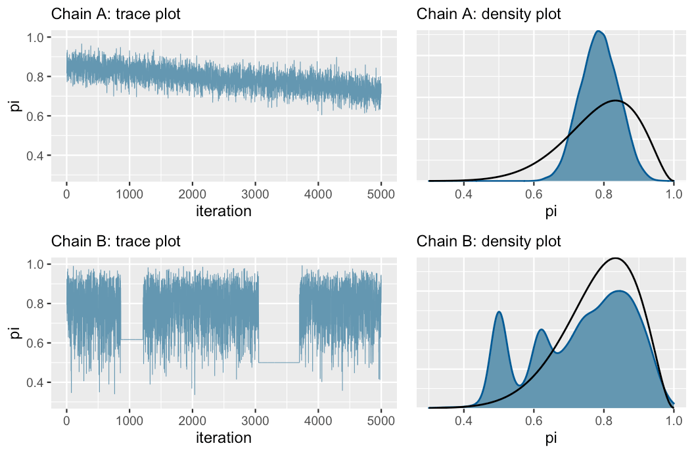
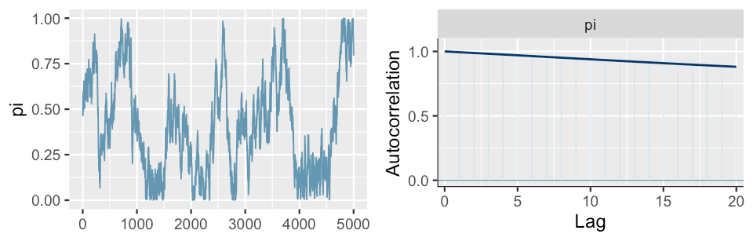
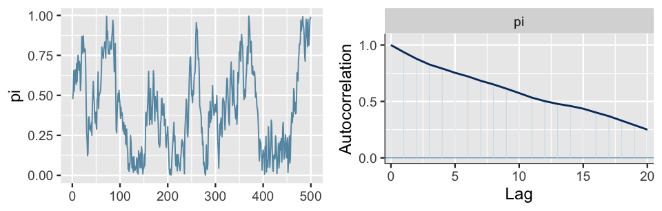
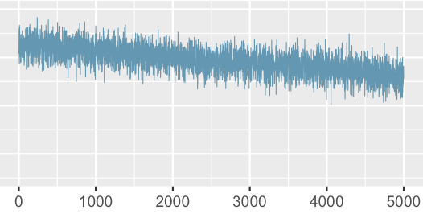
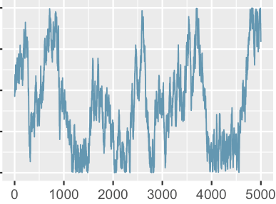
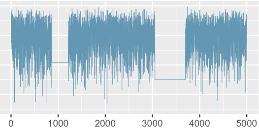
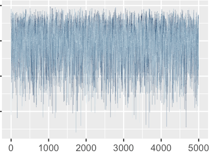




# Approximating the Posterior {#sec-chap-006}

```{r}
#| label: setup
#| results: hold
#| include: false

base::source(file = "R/helper.R")
ggplot2::theme_set(ggplot2::theme_bw())
```


::::: {#obj-chap-006}
:::: {.my-objectives}
::: {.my-objectives-header}
Objectives
:::

::: {.my-objectives-container}

- Implement and examine the limitations of using grid approximation to simulate a posterior model. 
- Explore the fundamental properties of `r glossary("MCMC")` posterior simulation techniques and how these differ from grid approximation. 
- Implement MCMC simulation in R. 
- Learn several `r glossary("Markov chain")` diagnostics for examining the quality of an MCMC posterior simulation.


:::
::::
:::::

## Grid approximation

We needn’t observe $f (\theta \mid y)$ at every possible $\theta$ to get a sense of its structure. Rather, we can evaluate $f (\theta \mid y)$ at a finite, discrete grid of possible $\theta$ values. Subsequently, we can take random samples from this discretized pdf to approximate the full posterior pdf $f (\theta \mid y)$.

::: {.callout-important #imp-006-grid-approximation}
###### Grid approximation

Grid approximation produces a sample of $N$ **independent** $\theta$ values, $\{\theta^{(1)}, \theta^{(2}), \cdots , \theta^{(N)}\}$, from a **discretized approximation** of posterior pdf $f (\theta \mid y)$.
:::

:::::{.my-procedure}
:::{.my-procedure-header}
:::::: {#prp-006-grid-approximation}
: Grid approximation
::::::
:::
::::{.my-procedure-container}
The grid approximation algorithm evolves in four steps:

1. Define a discrete grid of possible $\theta$ values. 
2. Evaluate the prior pdf $f (\theta)$ and likelihood function $L(\theta \mid y)$ at each $\theta$ grid value. 
3. Obtain a discrete approximation of the posterior pdf $f (\theta \mid y)$ by: 
    (a) calculating the product $f (\theta)L(\theta \mid y)$ at each $\theta$ grid value; and then 
    (b) normalizing the products so that they sum to $1$ across all $\theta$. 
4. Randomly sample $N$ $\theta$ grid values with respect to their corresponding normalized posterior probabilities.


::::
:::::

### Beta-Binomial example

#### Definition

To bring the grid approximation technique to life, let’s explore the following generic `r glossary("Beta-Binomial-Model", "Beta-Binomial model")` (one without a corresponding data story):  
 
$$
\begin{align*}
Y \mid \pi &\sim \text{Bin}(10, \pi) \\
\pi &\sim \text{Beta}(2, 2)
\end{align*}
$$ {#eq-006-beta-binomial-example}

  
We can interpret $Y$ here as the number of successes in $10$ independent trials. Each trial has probability of success $\pi$ where our prior understanding about $\pi$ is captured by a $\text{Beta}(2, 2)$ model. Suppose we observe $Y = 9$ successes. Then by our work in @sec-chap-003, we know that the updated posterior model of $\pi$ is Beta with parameters $11 \quad (Y + \alpha = 9 + 2)$ and $3 \quad (n − Y +\beta = 10 − 9 + 2)$:  

$$\pi \mid (Y = 9) \sim \text{Beta}(11, 3)$$

#### Approximation {#sec-006-approximation}

We’re now going to ask you to *forget* that we were able to specify this posterior. Instead, we’ll try to *approximate* the posterior using grid approximation.

:::::{.my-procedure}
:::{.my-procedure-header}
:::::: {#prp-006-detailed-steps-of-grid-approximation}
: Detailed steps of grid approximation
::::::
:::
::::{.my-procedure-container}

::: {#big-text style="font-size: 110%"}
**Step 1** 
:::

we need to split the continuum of possible $\pi$ values on $0 \text{ to } 1$ into a finite grid. We’ll start with a course grid of only $6$ $\pi$ values, $\pi \in \{0, 0.2, 0.4, 0.6, 0.8, 1\}$:

```{r}
#| code-fold: false

# Step 1: Define a grid of 6 pi values 
grid_data <- tibble::tibble(pi_grid = base::seq(from = 0, to = 1, length = 6))
```

::: {#big-text style="font-size: 110%"}
**Step 2** 
:::

We use `stats::dbeta()` and `stats::dbinom()`, respectively, to evaluate the $\text{Beta}(2, 2)$ `r glossary("priorx", "prior")` `r glossary("pdf")` and $\text{Bin}(10, \pi)$ `r glossary("Likelihood-Function", "likelihood function")` with $Y = 9$ at each $\pi$ in `pi_grid`:

```{r}
#| code-fold: false

# Step 2: Evaluate the prior & likelihood at each pi
grid_data <- grid_data |>  
  dplyr::mutate(prior = stats::dbeta(pi_grid, 2, 2),
         likelihood = stats::dbinom(9, 10, pi_grid))
```


::: {#big-text style="font-size: 110%"}
**Step 3** 
:::

We calculate the product of the likelihood and prior at each grid value. This provides an *unnormalized* discrete approximation of the `r glossary("posteriorx", "posterior")` pdf that doesn’t sum to one. We subsequently `r glossary("Normalizing Constant", "normalize")` this approximation by dividing each unnormalized posterior value by their collective sum:

```{r}
#| code-fold: false

# Step 3: Approximate the posterior
grid_data <- grid_data |>  
  dplyr::mutate(unnormalized = likelihood * prior,
         posterior = unnormalized / sum(unnormalized))

# Confirm that the posterior approximation sums to 1
grid_data |> 
  dplyr::summarize(sum(unnormalized), sum(posterior)) |> 
    knitr::kable(digits = 4)
  
```


The resulting discretized posterior pdf, rounded to 2 decimal places and plotted below, provides a very rigid glimpse into the *actual* posterior pdf. It places a roughly 99% chance on $\pi$ being either $0.6$ or $0.8$, a 1% chance on $\pi$ being 0.4, and a near 0% chance on the other $\pi$ grid values:


```{r}
#| label: tbl-006-grid-approx-posterior
#| tbl-cap: Examine the grid approximated posterior
#| code-fold: false

# Examine the grid approximated posterior
grid_data |> 
    knitr::kable(digits = 2)
```

```{r}
#| label: fig-006-grid-approx-posterior
#| fig-cap: Plot of the grid approximated posterior
#| fig-height: 3
#| fig-width: 4
#| code-fold: false

# Plot the grid approximated posterior
ggplot2::ggplot(grid_data, 
                ggplot2::aes(x = pi_grid, y = posterior)) + 
  ggplot2::geom_point() + 
  ggplot2::geom_segment(
      ggplot2::aes(x = pi_grid, xend = pi_grid, y = 0, yend = posterior))
```

::: {#big-text style="font-size: 110%"}
**Step 4** 
:::

Each sample draw has only 6 possible outcomes and is highly likely to be $0.6$ or $0.8$. Let’s try it: use `dplyr::slice_sample()` to take a sample of `n = 10000` values from the 6-length grid_data, with replacement, and using the discretized `posterior` probabilities as sample weights.

```{r}
#| label: tbl-sample-discretized-posterior
#| tbl-cap: Sample form the discetized Posterior
#| code-fold: false

# Step 4: sample from the discretized posterior

# Set the seed
set.seed(84735)

post_sample <- dplyr::slice_sample(grid_data, n = 10000, 
                        weight_by = posterior, replace = TRUE)


# A table of the 10000 sample values
post_sample |> 
  janitor::tabyl(pi_grid) |> 
  janitor::adorn_totals("row") |> 
  knitr::kable(digits = 4)
```

As expected, most of our $10,000$ sample values of $\pi$ were $0.6$ or $0.8$, few were $0.4$, and none were below $0.4$ or above $0.8$.


::::
:::::

This is an extremely oversimplified approximation of the true $\text{Beta}(11, 3)$ posterior. If you need any more convincing, Figure 6.2 superimposes the true posterior pdf $f (\pi \mid y)$ on a scaled histogram of the $10,000$ sample values. If this were a good approximation, the histogram would mimic the shape, location, and spread of the smooth pdf. It does not.


:::::{.my-r-code}
:::{.my-r-code-header}
:::::: {#cnj-005-grid-simulation-with-posterior}
: Histogram of the grid simulation with Posterior PDF
::::::
:::
::::{.my-r-code-container}
```{r}
#| label: fig-grid-simulation-with-posterior
#| fig-cap: A grid approximation of the posterior pdf of  π using only 6 grid values. The actual pdf is represented by the curve.
#| fig-height: 3
#| fig-width: 4

# Histogram of the grid simulation with posterior pdf
ggplot2::ggplot(post_sample, ggplot2::aes(x = pi_grid)) + 
  ggplot2::geom_histogram(
      ggplot2::aes(y = ggplot2::after_stat(density)), 
        color = "white",
        bins = 30,
        boundary = 0) +   ## added to ensure that bins start at 0
  ggplot2::stat_function(
      fun = dbeta, 
      args = list(11, 3),
      color = "darkred",
      linewidth = 1) + 
  ggplot2::xlim(0, 1)
```


::::
:::::

::: {.callout-note #nte-006-remove-warning}
###### Warning about values outside of range

The last line of the code in book (`lims(x = c(0, 1))`) produces a warning:

> Removed 2 rows containing missing values or values outside the scale range (`geom_bar()`).

My first solution was to use instead `coord_cartesian(xlim = c(0, 1)` to remove this warning. Although this worked in @fig-006-grid-simulation-101-values it didn't work here:

**Why it works in @fig-006-grid-simulation-101-values**

- `xlim()` and `ylim()` filter the data before plotting, removing rows that fall outside the range, which triggers the warning. 
- `coord_cartesian()` zooms the plot without removing data, so no rows are dropped and the warning is avoided.

**Why it didn't work in @fig-grid-simulation-with-posterior**

`ggplot2::coord_cartesian(xlim = c(0, 1))` zooms into the plot **after** the histogram bins are calculated, so the binning is based on the full data range, not just [0,1].  This can distort the appearance of the histogram, even if your data (pi_grid) is already within [0,1]

Here the solution is to add the histogram parameter `boundary = 0`. This ensures that bins start at 0.

:::

Instead of chopping up the 0-to-1 continuum of possible $˜pi$ values into a grid of only 6 values, let’s try a more reasonable grid of **101 values**: $\pi \in \{0, 0.01, 0.02, . . . , 0.99, 1\}$. The first 3 grid approximation steps using this refined grid are performed below:

:::::{.my-r-code}
:::{.my-r-code-header}
:::::: {#cnj-006-grid-approximation-101-values}
: Numbered R Code Title
::::::
:::
::::{.my-r-code-container}
```{r}
#| label: fig-grid-approximation-101-values
#| fig-cap: The discretized posterior pdf of π at 101 grid values.
#| fig-height: 3
#| fig-width: 4

# Step 1: Define a grid of 101 pi values
grid_data  <- tibble::tibble(
    pi_grid = base::seq(from = 0, to = 1, length = 101)
    )

# Step 2: Evaluate the prior & likelihood at each pi
grid_data <- grid_data |>  
  dplyr::mutate(prior = stats::dbeta(pi_grid, 2, 2),
         likelihood = stats::dbinom(9, 10, pi_grid))


# Step 3: Approximate the posterior
grid_data <- grid_data |>  
  dplyr::mutate(unnormalized = likelihood * prior,
         posterior = unnormalized / base::sum(unnormalized))

ggplot2::ggplot(grid_data, 
        ggplot2::aes(x = pi_grid, y = posterior)) + 
  ggplot2::geom_point() + 
  ggplot2::geom_segment(
        ggplot2::aes(
            x = pi_grid, 
            xend = pi_grid, 
            y = 0, 
            yend = posterior)
        )
```

::::
:::::

The resulting discretized posterior pdf is quite smooth, especially in comparison to the rigid approximation when we only used 6 grid values in @fig-006-grid-approx-posterior.

Finally, in step 4 of the grid approximation, we sample 10,000 draws from the discretized posterior pdf:

:::::{.my-r-code}
:::{.my-r-code-header}
:::::: {#cnj-006-grid-simulation-101-values}
: Grid approximation of the posterior pdf of π using 101 grid values.
::::::
:::
::::{.my-r-code-container}
```{r}
#| label: fig-006-grid-simulation-101-values
#| fig-cap: A grid approximation of the posterior pdf of π using 101 grid values. The actual pdf is represented by the curve.
#| fig-height: 3
#| fig-width: 4

# Set the seed
set.seed(84735)

# Step 4: sample from the discretized posterior
post_sample <- dplyr::slice_sample(grid_data, n = 10000, 
                        weight_by = posterior, replace = TRUE)

ggplot2::ggplot(post_sample, ggplot2::aes(x = pi_grid)) + 
    ggplot2::geom_histogram(
          ggplot2::aes(y = ggplot2::after_stat(density)), 
          color = "white", 
          binwidth = 0.05) + 
    ggplot2::stat_function(
        fun = dbeta, 
        args = list(11, 3),
        color = "darkred",
        linewidth = 1) + 
    ggplot2::coord_cartesian(xlim = c(0, 1))

```

::::
:::::

@fig-006-grid-simulation-101-values displays a histogram of the resulting sample values. The shape, location, and spread of these values mimic those of the true target posterior pdf $f (\pi \mid y)$, represented by the smooth curve.

Take a step back to appreciate what we’ve just accomplished. We’ve taken an independent sample from a discretized approximation of the posterior pdf $f (\pi \mid y)$ that’s defined only on a grid of $\pi$ values. The algorithm is pretty intuitive and didn’t require advanced programming skills to implement. Most of all, the result was a sample that behaves much like a random sample taken directly from $f (\pi \mid y)$ itself. 

Thus, grid approximation can be a lifeline in scenarios in which the posterior is intractable, providing an approximation that’s nearly indistinguishable from the “real thing.”

### Gamma-Poisson example

#### Definition

For practice, let’s apply the grid approximation technique to simulate the posterior of another Bayesian model, this time a Gamma-Poisson. Let $Y$ be the number of events that occur in a one-hour period, where events occur at an average rate of $\lambda$ per hour. Further, suppose we collect two data points ($Y_1, Y_2$) and place a $\text{Gamma}(3, 1)$ prior on $\lambda$:

$$
\begin{align*}
Y_i \mid \lambda &\overset{\text{ind}}{\sim} Pois(λ) \\ 
\lambda &\sim \text{Gamma}(3, 1)
\end{align*}
$$ {#eq-006-gamma-poisson-example}


If we observe $Y_1 = 2$ events in the first one-hour observation period and $Y_2 = 8$ in the next, then by our work in @sec-chap-005 specifically @eq-005-gamma-poisson-model, the updated posterior model of $\lambda$ is Gamma with parameters 13 ($s + \sum{Y} = 3 + 10$) and 3 ($r + n = 1 + 2$):

$$
\lambda \mid ((Y_1, Y_2) = (2, 8)) \sim \text{Gamma}(13, 3)
$$ {#eq-006-gamma-poisson-example2}

(There is a typo in the book: $Y_2 = 8$ and not $3$ as in the book.)

#### Approximation

##### Step 1: Determine grid

To simulate this posterior using grid approximation, **Step 1** is to specify a discrete grid of reasonable $\lambda$ values. Unlike the π parameter in the Beta-Binomial which is restricted to the finite 0-to-1 interval, the Poisson parameter $\lambda$ can technically take on any non-negative real value ($\lambda \in [0, \infty)$). 

However, in a plot of the Gamma prior pdf and Poisson likelihood function it appears that, though possible, values of $\lambda$ beyond 15 are implausible (@fig-006-gamma-poisson-prior-likelihood).

:::::{.my-r-code}
:::{.my-r-code-header}
:::::: {#cnj-006-gamma-poisson-prior-likelihood}
:  Plot of the Gamma prior pdf and Poisson likelihood function
::::::
:::
::::{.my-r-code-container}
```{r}
#| label: fig-006-gamma-poisson-prior-likelihood
#| fig-cap: A Gamma prior pdf and scaled Poisson likelihood function for λ.
#| fig-height: 3

bayesrules::plot_gamma_poisson(
    shape = 3,
    rate = 1,
    sum_y = 10,
    n = 2,
    posterior = FALSE
)
```

::::
:::::

##### Step 2: Grid approximation quiz

With this in mind, we’ll set up a discrete grid of $\lambda$ values between 0 and 15, essentially truncating the posterior’s tail. Before completing the corresponding grid approximation together, we encourage you to challenge yourself by first trying the quiz below.


:::::{.my-assessment}
:::{.my-assessment-header}
:::::: {#cor-006-quiz-grid-approx}
: Construct a grid approximation of the Gamma-Poisson posterior
::::::
:::
::::{.my-assessment-container}

Fill in the code below to construct a grid approximation of the Gamma-Poisson posterior corresponding to @eq-006-gamma-poisson-example. In doing so, use a grid of 501 $\lambda$ values between 0 and 15.

If you have difficulties then use the step-by-step example in @sec-006-approximation for the Beta-Binomial as a template changing those parts that are different for the Gamma-Poisson.

::: {#big-text style="font-size: 110%"}
**Step 1: Define a grid of 501 lambda values**
:::

::: {#monospace-text style="font-family: 'Fira Code', monospace"}
grid_data <- data.frame(    
&nbsp;&nbsp;lambda_grid = seq(   
&nbsp;&nbsp;&nbsp;&nbsp;from = `r fitb(0, width = 3)`,     
&nbsp;&nbsp;&nbsp;&nbsp;to = `r fitb(15, width = 3)`,      
&nbsp;&nbsp;&nbsp;&nbsp;length = `r fitb(501, width = 3)`)    
&nbsp;&nbsp;&nbsp;&nbsp;)
:::


::: {#big-text style="font-size: 110%"}
**Step 2: Evaluate the prior & likelihood at each lambda**
:::

::: {#monospace-text style="font-family: 'Fira Code', monospace"}
grid_data <- grid_data  |>      
&nbsp;&nbsp;`r fitb("mutate", width = 10)`(prior =       
&nbsp;&nbsp;&nbsp;&nbsp;dgamma(`r fitb("lambda_grid∫", width = 10)`,     
&nbsp;&nbsp;&nbsp;&nbsp;&nbsp;&nbsp;`r fitb(3, width = 10)`,      
&nbsp;&nbsp;&nbsp;&nbsp;&nbsp;&nbsp;`r fitb(1, width = 10)`)),    
&nbsp;&nbsp;&nbsp;&nbsp;&nbsp;&nbsp;&nbsp;&nbsp;&nbsp;likelihood = dpois(`r fitb(2, width = 10)`,`r fitb("lambda_grid", width = 10)`) * 
&nbsp;&nbsp;&nbsp;&nbsp;&nbsp;&nbsp;&nbsp;&nbsp;&nbsp;&nbsp;&nbsp;&nbsp;dpois(`r fitb(8, width = 10)`, `r fitb("lambda_grid", width = 10)`))
:::

::: {#big-text style="font-size: 110%"}
**Step 3: Approximate the posterior**
:::

::: {#monospace-text style="font-family: 'Fira Code', monospace"}
grid_data <- grid_data  |>       
&nbsp;&nbsp;`r fitb("mutate", width = 10)`(unnormalized = `r fitb("likelihood", width = 10)` *  `r fitb("prior", width = 10)`,         
&nbsp;&nbsp;&nbsp;&nbsp;&nbsp;&nbsp;&nbsp;&nbsp;&nbsp;&nbsp;&nbsp;&nbsp;&nbsp;&nbsp;&nbsp;posterior = `r fitb("unnormalized", width = 10)` / `r fitb("sum(unnormalized)", width = 10)`))
:::
        
**Set the seed**

::: {#monospace-text style="font-family: 'Fira Code', monospace"}
set.seed(84735)  
:::

::: {#big-text style="font-size: 110%"}
**Step 4: sample from the discretized posterior**
:::


::: {#monospace-text style="font-family: 'Fira Code', monospace"}
post_sample <- slice_sample(`r fitb("grid_data", width = 10)`, n = `r fitb(10000, width = 10)`,        
&nbsp;&nbsp;&nbsp;&nbsp;&nbsp;&nbsp;&nbsp;&nbsp;weight_by = `r fitb("posterior", width = 10)`, replace = `r fitb("TRUE", width = 10)`)
:::


::::
:::::


Check out the complete code of @cor-006-quiz-grid-approx. Much of this is the same as it was for the Beta-Binomial model. There are two key differences. 

1. First, we use `dgamma()` and `dpois()` instead of `dbeta()` and `dbinom()` to evaluate the prior pdf and likelihood function of $\lambda$. 
2. Second, since we have a sample of two data points $(Y_1, Y_2) = (2, 8)$, the Poisson likelihood function of $\lambda$ must be calculated by the product of the marginal Poisson pdfs, $L(\lambda \mid y_1, y_2) = f (y_1, y2 \mid \lambda) =  f (y_1 \mid \lambda) \cdot f (y_2 \mid \lambda)$.

##### Step 2: Grid approximation exercise

If you have successfully filled in the quiz try now a more complex exercise. Try it out without looking into @cor-006-quiz-grid-approx. In contrast to @cor-006-quiz-grid-approx you have to fill in all the gaps before you can run the (real) code and see if it gets as output the structure of the `post_sample`.


Remember: Use a grid of 501 with values between 0 and 15 applying the formula @eq-006-gamma-poisson-example resp. @eq-006-gamma-poisson-example2:

$$
\begin{align*}
Y_i \mid \lambda &\overset{\text{ind}}{\sim} Pois(λ) \\ 
\lambda &\sim \text{Gamma}(3, 1) \\
\\
\lambda \mid ((Y_1, Y_2) = (2, 8)) &\sim \text{Gamma}(13, 3).
\end{align*}
$$
**Construct a grid approximation of the Gamma-Poisson posterior corresponding to @prp-006-detailed-steps-of-grid-approximation.**

```{webr}
#| label: construct-grid-approximation-gamma-poisson-posterior
#| exercise: ex-1

# Step 1: Define a grid of 501 lambda values
grid_data   <- data.frame(
    lambda_grid = seq(from = ___, to = ___, length = ___)
    )

# Step 2: Evaluate the prior & likelihood at each lambda
grid_data <- grid_data |> 
  dplyr::___(prior = dgamma(___, ___, ___),
         likelihood = dpois(___, ___) * dpois(___, ___)
      )

# Step 3: Approximate the posterior
grid_data <- grid_data |>  
  dplyr::___(unnormalized = ___ * ___,
         posterior = ___ / ___)

# Set the seed
set.seed(84735)

# Step 4: sample from the discretized posterior
post_sample <- dplyr::slice_sample(___, n = ___, 
                        weight_by = ___, replace = ___)

dplyr::glimpse(post_sample)
```

Compare your result with the following code and output:


```{r}
#| label: construct-grid-approximation-gamma-poisson-posterior2
#| lst-label: lst-construct-grid-approximation-gamma-poisson-posterior
#| lst-cap: Show the code for the above exercise

# Step 1: Define a grid of 501 lambda values
grid_data   <- data.frame(lambda_grid = seq(from = 0, to = 15, length = 501))

# Step 2: Evaluate the prior & likelihood at each lambda
grid_data <- grid_data |> 
  dplyr::mutate(prior = dgamma(lambda_grid, 3, 1),
         likelihood = dpois(2, lambda_grid) * dpois(8, lambda_grid))

# Step 3: Approximate the posterior
grid_data <- grid_data |> 
  dplyr::mutate(unnormalized = likelihood * prior,
         posterior = unnormalized / sum(unnormalized))

# Set the seed
set.seed(84735)

# Step 4: sample from the discretized posterior
post_sample2 <- dplyr::slice_sample(grid_data, n = 10000, 
                        weight_by = posterior, replace = TRUE)

dplyr::glimpse(post_sample2)
```


#### Step 2: Grid approximation final

Most importantly, grid approximation again produced a decent approximation of our target posterior:

:::::{.my-r-code}
:::{.my-r-code-header}
:::::: {#cnj-006-grid-approximation-gamma-poisson-example}
: Grid approximation of the posterior pdf of $\lambda$ using 501 grid values
::::::
:::
::::{.my-r-code-container}
```{r}
#| label: fig-006-grid-approximation-gamma-poisson-example
#| fig-cap: A grid approximation of the posterior pdf of λ using 501 grid values. The actual pdf is represented by the red curve.
#| fig-width: 4
#| fig-height: 3

# Step 1: Define a grid of 501 lambda values
grid_data   <- data.frame(lambda_grid = seq(from = 0, to = 15, length = 501))

# Step 2: Evaluate the prior & likelihood at each lambda
grid_data <- grid_data |>  
  dplyr::mutate(prior = dgamma(lambda_grid, 3, 1),
         likelihood = dpois(2, lambda_grid) * dpois(8, lambda_grid))

# Step 3: Approximate the posterior
grid_data <- grid_data |>  
  dplyr::mutate(unnormalized = likelihood * prior,
         posterior = unnormalized / sum(unnormalized))

# Set the seed
set.seed(84735)

# Step 4: Sample from the discretized posterior
post_sample <- dplyr::slice_sample(grid_data, n = 10000, 
                        weight_by = posterior, replace = TRUE)

# Histogram of the grid simulation with posterior pdf 
ggplot2::ggplot(post_sample, ggplot2::aes(x = lambda_grid)) + 
  ggplot2::geom_histogram(
      ggplot2::aes(y = ggplot2::after_stat(density)), 
            color = "black",
            binwidth = 0.5,
            boundary = 0) + 
  ggplot2::stat_function(
      fun = dgamma, 
      args = list(13, 3),
      linewidth = 1,
      color = "darkred") + 
  ggplot2::lims(x = c(0, 15))
```

::::
:::::


### Limitation

Limitations in the grid approximation method quickly present themselves as our models get more complicated. For example, by the end of Unit 4 we’ll be working with models that have lots of model parameters $\theta = (\theta_1, \theta_2, . . . , \theta_k)$. In such settings, grid approximation suffers from the **curse of dimensionality**.

When using grid approximation to simulate multivariate posteriors, we need to divide the multidimensional sample space of $\theta = (\theta_1, \theta_2, . . . , \theta_k)$ into a very, very fine grid in order to prevent big gaps in our approximation. In practice, this might not be feasible. When evaluated on finer and finer grids, the grid approximation method becomes computationally expensive. You can’t merely start the simulation, get up for a cup of coffee, come back, and poof the simulation is done. You might have to start the simulation and go off to a month-long meditation retreat (to practice the patience you’ll need for grid approximation). `r glossary("MCMC")` methods provide a more flexible alternative.


## Markov chains via {rstan}

The `r glossary("Markov chain")` component of `r glossary("MCMC")` is named for the Russian mathematician Andrey Markov (1856-1922). The etymology of the Monte Carlo component is more dubious:

As part of their top secret nuclear weapons project in the 1940s, Stanislav Ulam, John von Neumann, and their collaborators at the Los Alamos National Laboratory used Markov chains to simulate and better understand neutron travel [@roger1987]. The Los Alamos team referred to their work by the code name “Monte Carlo,” a choice said to be inspired by the opulent Monte Carlo casino in the French Riviera. What inspired the link between random simulation methods and casinos? We can’t help you there.

Today, “Markov chain Monte Carlo” refers to the application of Markov chains to simulate probability models using methods pioneered by the Monte Carlo project. In contrast to grid approximation, MCMC simulation methods scale up for more complicated Bayesian models. But this flexibility doesn’t come for free. Like grid approximation samples, **MCMC samples are *not* taken directly from the posterior pdf** $f (\theta \mid y)$. Yet unlike grid approximation samples, **MCMC samples aren’t even independent** – each subsequent sample value depends directly upon the previous value. This feature is evoked by the “chain” terminology. 

Specifically, let $\{\theta^{(1)}, \theta^{(2)}, . . . , \theta^{(N)}\}$ be an N-length MCMC sample, or **Markov chain**. In  constructing this chain, (2) is drawn from some model that depends upon $\theta^{(1)}$, $\theta^{(3)}$ is drawn from some model that depends upon $\theta^{(2)}$, $\theta^{(4)}$ is drawn from some model that depends upon $\theta^{(3)}$, and so on and so on the chain grows. In general, the (i + 1)st chain value $\theta^{(i+1)} is drawn from a model that depends on data $y$ and the previous chain value $\theta^{(i)}$ with conditional pdf

$$
f (\theta^{(i+1)} \mid \theta^{(i)}, y)
$$

There are a couple of things to note about this dependence among chain values. First, by the **Markov property**, $\theta^{(i+1)}$ depends upon the preceding chain values only through the most recent value $\theta^{(i)}$:  

$$
f (\theta^{(i+1)} \mid \theta^{(1)}, \theta^{(2)}, . . . , \theta^{(i)}, y) = f (\theta^{(i+1)} \mid \theta^{(i)}, y)
$$

For example, since $\theta^{(i+i)}$ depends on $\theta^{(i)}$ which depends on $\theta^{(i-1)}$, it’s also true that $\theta^{(i+i)}$ depends on $\theta^{(i-1)}$. However, if we know $\theta^{(i)}$, then $\theta^{(i-1)}$ is of no consequence to $\theta^{(i+1)}$ – the only information we need to simulate $\theta^{(i+1)}$ is the value of $\theta^{(i)}$. Further, each chain value can be drawn from a different model, and none of these models are the target posterior. That is, the pdf from which a Markov chain value is simulated is not equivalent to the posterior pdf: 

$$
f (\theta^{(i+1)} \mid \theta^{(i)}, y) \ne f (\theta^{(i+1)} \mid y)
$$

::: {.callout-important #imp-006-markov-chain}
###### Markov Chain Monte Carlo (MCMC)

`r glossary("MCMC")` simulation produces a chain of N **dependent** $\theta$ values,
\theta^{(1)}, \theta^{(2)}, . . . , \theta^{(N)}, which are **not** drawn from the posterior pdf $f (\theta \mid y)$.
:::


It likely seems strange to approximate the posterior using a dependent sample that’s not even taken from the posterior. But mathemagically, with reasonable MCMC *algorithms*, it can work. The rub is that these algorithms have a steeper learning curve than the grid approximation technique.

:::::{.my-resource}
:::{.my-resource-header}
:::::: {#lem-006-mcmc-resources}
: MCMC resources
::::::
:::
::::{.my-resource-container}

We provide a glimpse into the details of the MCMC workings in @sec-chap-007. 

Though a review of @sec-chap-007 and a firm grasp of these details would be ideal, there’s a growing number of MCMC computing resources that can do the heavy lifting for us:

- In this book, we’ll conduct MCMC simulation using the {**rstan**} package [@rstan] which combines the power of R with the Stan engine. You’ll get into the nitty gritty of {**rstan**} in this chapter, building up the code line by line and thereby gaining familiarity with the key elements of an {**rstan**} simulation. 
- Starting in @sec-chap-009, you will utilize the complementary {**rstanarm**} package [@rstanarm], which provides shortcuts for simulating a broad framework of Bayesian *applied regression models* (arm).

::::
:::::


### Beta-Binomial example {#sec-006-beta-binomial-example}

There are two essential steps to all rstan analyses: 

(1) **define the Bayesian model structure** in {**rstan**} notation and 
(2) **simulate the posterior**. 

#### Step 1: Define model structure

Let’s examine these steps in the context of the Beta-Binomial model defined by @eq-006-beta-binomial-example, starting with step 1. In defining the structure of this model, we must specify the three aspects upon which it depends:  

::: {#big-text style="font-size: 120%"}
**data** 
:::
 
Data $Y$ is the observed number of successes in $10$ trials. Since {**rstan**} isn’t a mind reader, we must specify that $Y$ is an integer between $0$ and $10$.

::: {#big-text style="font-size: 120%"}
**parameters** 
:::
  
The model depends upon parameter $\pi$, or `pi` in {**rstan**} notation. We must specify that $\pi$ can be any real number between $0$ and $1$.  

::: {#big-text style="font-size: 120%"}
**model** 
:::
  
The model is defined by the $\text{Bin}(10, \pi)$ model for data $Y$ and the $\text{Beta}(2, 2)$ prior for $\pi$. We specify these using `binomial()` and `beta()`.  Below we translate this Beta-Binomial structure into {**rstan**} syntax and store it as the character string `bb_model`. We encourage you to pause and examine the code, noting how it matches up with the three aspects above.

:::::{.my-r-code}
:::{.my-r-code-header}
:::::: {#cnj-006-beta-binomial-rstan-syntax}
: Step 1: Define Beta-Binomial in {rstan}-syntax
::::::
:::
::::{.my-r-code-container}
```{r}
#| label: beta-binomial-rstan-syntax
#| lst-label: lst-006-beta-binomial-rstan-syntax
#| lst-cap: "Step 1: Define Beta-Binomial in {**rstan**}-syntax"
#| code-fold: false

# STEP 1: DEFINE the model
bb_model <- "
  data {
    int<lower = 0, upper = 10> Y;
  }
  parameters {
    real<lower = 0, upper = 1> pi;
  }
  model {
    Y ~ binomial(10, pi);
    pi ~ beta(2, 2);
  }
"
```

::::
:::::

#### Step 2: Simulate the posterior

In **step 2**, we *simulate* the posterior using the `rstan::stan()` function. Very loosely speaking, `rstan::stan()` designs and runs an MCMC algorithm to produce an approximate sample from the Beta-Binomial posterior.

::: {.callout-warning #wrn-006-stan-slow}
###### Simulation is quite slow for each new model

Since `rstan::stan()` has to do the double duty of identifying an appropriate MCMC algorithm for simulating the given model, and then applying this algorithm to our data, the simulation will be **quite slow for each new or changed model**. 

Although it is only about 15 seconds on my Apple M4 Pro, 48 GB memory, Tahoe 26.3., but this time has to be calculated for **every** code chunk simulated a given model. Therefore I looked for ways to minimize time for MCMC simulations. One strategy would be to cache the time-consuming compilation process. It turned out that for this solution I need to change from RStan to CmdStanR. CmdStanR with the {**cmdstanr**} package has many other advantages as well and is therefore the recommended approach.

**For my explorations into CmdStanR see annex @sec-chap-905.**


::: {#big-text style="font-size: 125%"}
**How to minimize time for MCMC simulations in RStan?** 
:::

The following recommended strategies are the result of free version of `r glossary("Claude Sonnet 4.5", "Claude Sonnet")` included in the Brave browser Leo AI:

::: {#big-text style="font-size: 115%"}
**Reducing Computation Time** 
:::


**1. Optimize your Stan model**

- Use vectorized operations instead of loops
- Choose efficient parameterizations (e.g., non-centered parameterization for hierarchical models)
- Avoid redundant calculations in the `model` block — move static computations to `transformed data`

**2. Tune MCMC parameters**

```r
fit <- stan(
  file = "model.stan",
  data = data_list,
  chains = 4,
  iter = 2000,        # Reduce if convergence is fast
  warmup = 500,       # Reduce warmup iterations
  thin = 1,           # Avoid thinning unless memory is an issue
  cores = parallel::detectCores()  # Parallelize chains
)
```

**3. Use `cmdstanr` instead of `rstan`**

- `cmdstanr` is generally faster and uses the latest CmdStan backend
- Supports multithreading within chains via `threads_per_chain`

**4. Reduce data size**

- Subset or aggregate data where statistically valid
- Use sufficient statistics when possible

::: {#big-text style="font-size: 115%"}
**Caching Results** 
:::


**Option 1: Save/load the fit object with `saveRDS`** *(simplest)*

```r
fit_file <- "my_model_fit.rds"

if (file.exists(fit_file)) {
  fit <- readRDS(fit_file)
} else {
  fit <- stan(file = "model.stan", data = data_list, ...)
  saveRDS(fit, fit_file)
}
```

**Option 2: Cache compiled Stan model separately**

Compiling is expensive — cache the compiled model to reuse it:

```r
model_file <- "compiled_model.rds"

if (file.exists(model_file)) {
  model <- readRDS(model_file)
} else {
  model <- stan_model(file = "model.stan")
  saveRDS(model, model_file)
}

fit <- sampling(model, data = data_list, ...)
```

**Option 3: Use the `targets` package** *(best for reproducible pipelines)*

```r
# _targets.R
library(targets)

list(
  tar_target(stan_data, prepare_data()),
  tar_target(stan_model, stan_model("model.stan")),
  tar_target(fit, sampling(stan_model, data = stan_data, ...))
)
```
`targets` automatically skips re-running steps when inputs haven't changed.

::: {#big-text style="font-size: 115%"}
**Quick Summary** 
:::

| Goal | Approach |
|---|---|
| Faster sampling | Parallelize chains, tune `iter`/`warmup` |
| Better model efficiency | Vectorize, non-centered parameterization |
| Cache compiled model | `saveRDS` on `stan_model()` |
| Cache full fit | `saveRDS` on the fit object |
| Reproducible pipeline | Use `targets` package |

:::

Note that `rstan::stan()` requires two types of arguments. 

1. First, we must specify the **model information** by:  

- `model_code` = the character string defining the model (here `bb_model`) 
- `data` = a list of the observed data (here `Y = 9`).  

2. Second, we must specify the desired **Markov chain information** using three additional arguments:  

- The `chains` argument specifies how many parallel Markov chains to run. We run four chains here, thus obtain four distinct samples of $\pi$ values. We discuss this choice in Section 6.3.  
- The `iter` argument specifies the desired number of iterations in, or *length* of, each Markov chain. By default, the first half of these iterations are thrown out as “burn-in” or “warm-up” samples (see below for details). The second half are kept as the final Markov chain sample.  
- To set the random number generating seed for an {**rstan**} simulation, we utilize the `seed` argument *within* the `rstan::stan()` function. 

The result, stored in `bb_sim`, is a `stanfit` object. This object includes four parallel Markov chains run for 10,000 iterations each. After tossing out the first 5,000 iterations of all four chains, we end up with four separate Markov chain samples of size 5,000, or a combined **Markov chain sample size** of 20,000.

The first four $\pi$ values for each of the four parallel chains are extracted and shown here:

:::::{.my-r-code}
:::{.my-r-code-header}
:::::: {#cnj-006-beta-binomial-example-simulation}
: Step 2: Simulation of the Beta-Binomial example
::::::
:::
::::{.my-r-code-container}

```{r}
#| label: tbl-006-beta-binomial-example-simulation
#| tbl-cap: "Step 2: Simulation of the Beta-Binomial example"
#| lst-label: lst-006-beta-binomial-example-simulation
#| lst-cap: "Step 2: Simulation of the Beta-Binomial example"
#| code-fold: false
#| results: hold

# STEP 2: SIMULATE the posterior
bb_sim <- rstan::stan(model_code = bb_model, data = list(Y = 9), 
               chains = 4, iter = 5000*2, seed = 84735)

as.array(bb_sim, pars = "pi") |>
  head(4) |>
    knitr::kable()

# Summarize posterior
print(bb_sim)

# Extract posterior samples
posterior_samples <- rstan::extract(bb_sim)
pi_samples <- posterior_samples$pi
```

::::
:::::

::: {.callout-note #nte-006-mcmc-sampling-messages}
###### MCMC sampling messages

As you can see from @tbl-006-beta-binomial-example-simulation (@lst-006-beta-binomial-example-simulation) there is a long output with details of the sampling process and process information during simulation.


The MCMC sampling messages contain a lot of diagnostics about the sampling process. Although most of the indicators can be generated with special functions and are explained in more detail in @sec-006-markov-chains-diagnostics, the output line per line of the MCMC sampling messages is in "Bayes rules!" not explained. What follows is the result of `r glossary("LLMs")` answers  of `r glossary("Claude Haiku")` and `r glossary("Qwen-VL-235B")`:

::: {#big-text style="font-size: 115%"}
**Interpretation of the MCMC sampling messages** 
:::

**Chain initialization and diagnostics:**

- `SAMPLING FOR MODEL 'anon_model' NOW (CHAIN X)` — Indicates which chain is running.
- `Gradient evaluation took X seconds` — Time to compute the gradient (used in the NUTS sampler). Fast gradients = efficient sampling.
- `1000 transitions using 10 leapfrog steps per transition would take X seconds` — Estimates computational speed; helps set expectations for total runtime.

**Iteration progress:**

- `Iteration: X / 10000 [Y%] (Warmup)` — Shows progress during the burn-in phase (first 5000 iterations).
- `Iteration: X / 10000 [Y%] (Sampling)` — Shows progress during the actual sampling phase (iterations 5001–10000).

**Timing summary:**

- `Elapsed Time: X seconds (Warm-up)` — Time spent in burn-in.
- `Elapsed Time: X seconds (Sampling)` — Time spent collecting posterior samples.
- `Elapsed Time: X seconds (Total)` — Total runtime for that chain.

**Final inference table:**

- **`mean`** — Posterior mean of each parameter.
- **`se_mean`** — Standard error of the mean estimate.
- **`sd`** — Posterior standard deviation.
- **`2.5%, 25%, 50%, 75%, 97.5%`** — Quantiles (credible intervals).
- **`n_eff`** — Effective sample size (accounts for autocorrelation; ideally close to total draws).
- **`Rhat`** — Potential scale reduction factor (convergence diagnostic; should be ≈ 1.0).
- **`lp__`** — Log-posterior (model fit quality; not a parameter).

**There is more information in @sec-chap-906.**

::: {#big-text style="font-size: 115%"}
**When to use or not to use?** 
:::

**✅ IMPORTANT — Use when:**

- **First time fitting a model** — Check `Rhat` values (should be < 1.01 for convergence).
- **Diagnosing problems** — If `n_eff` is very low or `Rhat` > 1.05, something is wrong.
- **Assessing computational efficiency** — Timing helps identify slow models.
- **Publishing/reporting** — Include `Rhat` and `n_eff` in results for credibility.

**❌ NOT NEEDED — Skip when:**

- **Routine analyses** — After you've verified the model works well, you don't need this detail.
- **Interactive exploration** — Too verbose for quick iterations.
- **Production pipelines** — Clutters logs unnecessarily.

::: {#big-text style="font-size: 115%"}
**How to Hide or Turn Off This Information** 
:::


**Option 1: Suppress verbose output**

```r
bb_sim <- rstan::stan(model_code = bb_model, data = list(Y = 12), 
               chains = 4, iter = 5000*2, seed = 84735,
               verbose = FALSE)  # Hides chain-by-chain progress
```

**Option 2: Redirect to a file (keeps it but doesn't print)**

```r
bb_sim <- rstan::stan(model_code = bb_model, data = list(Y = 12), 
               chains = 4, iter = 5000*2, seed = 84735,
               verbose = FALSE,
               refresh = 0)  # Suppresses iteration updates
```

**Option 3: Maximum suppression**

```r
bb_sim <- rstan::stan(model_code = bb_model, data = list(Y = 12), 
               chains = 4, iter = 5000*2, seed = 84735,
               verbose = FALSE,
               refresh = 0,
               show_messages = FALSE)  # Hides all messages
```

**Option 4: Still get summary without chain details**

```r
# After fitting, just print summary without re-running
print(bb_sim)  # Shows only the final inference table
```

**Recommended approach:**

```r
bb_sim <- rstan::stan(model_code = bb_model, data = list(Y = 12), 
               chains = 4, iter = 5000*2, seed = 84735,
               refresh = 0)  # Clean output, still shows final summary
```

:::


It’s important to remember that these **Markov chain values are NOT a random sample from the posterior and are NOT independent**. Rather, each of the four parallel chains forms a dependent 5,000 length Markov *chain* of $\pi$ values, $(\pi^{(1)}, \pi^{(2)}, . . . , \pi^{(5000)})$. 

For  example, in iteration 1, `chain:1` starts at a value of roughly $\pi^{(1)}$ = `r rstan::extract(bb_sim, permuted = FALSE)[1]`. The value at iteration 2, $\pi^{(2)}$, depends upon $\pi^{(1)}$. In this case the chain moves from `r rstan::extract(bb_sim, permuted = FALSE)[1]` to `r rstan::extract(bb_sim, permuted = FALSE)[2]`. Similarly, the chain moves from `r rstan::extract(bb_sim, permuted = FALSE)[2]` to `r rstan::extract(bb_sim, permuted = FALSE)[3]`, from `r rstan::extract(bb_sim, permuted = FALSE)[3]` to `r rstan::extract(bb_sim, permuted = FALSE)[4]`, and so on. Thus, the chain traverses the sample space or range of posterior plausible $\pi$ values. 

A Markov chain trace plot illustrates this traversal, plotting the $\pi$ value (y-axis) in each iteration (x-axis). We use the `mcmc_trace()` function in the {**bayesplot**} package [@bayesplot] to construct the trace plots of all four Markov chains:

:::::{.my-r-code}
:::{.my-r-code-header}
:::::: {#cnj-006-trace-plot-beta-binomial-example}
: Trace plot for the Beta-Binomial example
::::::
:::
::::{.my-r-code-container}
```{r}
#| label: fig-006-trace-plot-beta-binomial-example
#| fig-cap: Trace plots of the four parallel Markov chains of π for the Beta_Binomial example
#| fig-height: 3
#| cache: true

bayesplot::color_scheme_set("viridisA")
bayesplot::mcmc_trace(bb_sim, pars = "pi", size = 0.5)
```

::::
:::::

::: {.callout-note #nte-006-trace-plot}
###### Many parameters

There are many parameters available for `bayesplot::mcmcm_trace()` that I do not understand (yet). I have experimented with two parameters:

- the line width (aka `size`): In the book is recommended 0.1,. Default value is 0.5 which gives in my opinion a trace plot that is better visible and interpretable.
- the color scheme: This is actually a different function `color_scheme_set()` but can be used in conjunction with `bayesplot::mcmcm_trace()` to improve the visibility of the trace plot.
:::


:::::{.my-r-code}
:::{.my-r-code-header}
:::::: {#cnj-006-trace-plot-first-iterations}
: Trace plot with the first 20 resp. 200 iterations
::::::
:::
::::{.my-r-code-container}


```{r}
#| label: fig-trace-plot-first-iterations
#| fig-cap: A trace plot of the first 20 iterations (left) and 200 iterations (right) of the first Beta-Binomial Markov chain.
#| fig-height: 3

# Extract all chains as a 3D array [iterations, chains, parameters]
chains_array <- as.array(bb_sim)

# Create a data frame from the first 20 iterations of chain 1
chain1_df_20 <- data.frame(
  iteration = 1:20,
  pi        = chains_array[1:20, 1, "pi"]
)

# Create a data frame from the first 200 iterations of chain 1
chain1_df_200 <- data.frame(
  iteration = 1:200,
  pi        = chains_array[1:200, 1, "pi"]
)

# Plot the first 20 iterations
p_20 <- ggplot2::ggplot(chain1_df_20, 
                ggplot2::aes(x = iteration, y = pi)) +
  ggplot2::geom_line(linewidth = 0.5) +
  ggplot2::labs(
    title = "Trace plot: Chain 1 (first 20 iterations)",
    x     = "Iteration",
    y     = expression(pi)
  )

# Plot the first 200 iterations
p_200 <- ggplot2::ggplot(chain1_df_200, 
                ggplot2::aes(x = iteration, y = pi)) +
  ggplot2::geom_line(linewidth = 0.5) +
  ggplot2::labs(
    title = "Trace plot: Chain 1 (first 200 iterations)",
    x     = "Iteration",
    y     = expression(pi)
  )

# plot both results side by side
patchwork:::"-.ggplot"(p_20, p_200)
```


::::
:::::

@fig-trace-plot-first-iterations zooms in on the trace plot of chain 1. In the first 20 iterations (left), the chain largely explores values between 0.61 and 0.91. After 200 iterations (right), the Markov chain has started to explore new territory, traversing a wider range of values between 0.40 and 0.96. Both trace plots also exhibit evidence of the slight dependence among the Markov chain values, places where the chain tends to float up for multiple iterations and then down for multiple iterations.

Marking the *sequence* of the chain values, the trace plots in @fig-trace-plot-first-iterations illuminate the Markov chains’ **longitudinal** behavior. We also want to examine the **distribution** of the values these chains visit along their journey, ignoring the order of these visits. 

The histogram and density plot in Figure 6.10 provide a snapshot of this distribution for the combined 20,000 chain values, 5,000 from each of the four separate chains. Notice the important punchline here: the distribution of the Markov chain values is an excellent approximation of the target Beta(11, 3) posterior model of $\pi$ (superimposed in black). That’s a relief – that was the whole point.

:::::{.my-r-code}
:::{.my-r-code-header}
:::::: {#cnj-006-plot-combined-chain-values}
: Plot distribution of the combined 20,000 chain values
::::::
:::
::::{.my-r-code-container}
```{r}
#| label: fig-006-plot-combined-chain-values
#| fig-cap: A histogram (left) and density plot (right) of the combined 20,000 Markov chain π values from the 4 parallel chains. The target pdf is superimposed in red.
#| fig-height: 3

# Histogram of the Markov chain values
bayesplot::color_scheme_set("teal")
p1 <- bayesplot::mcmc_hist(bb_sim, pars = "pi", bins = 30) + 
  bayesplot::yaxis_text(TRUE) + 
  ggplot2::ylab("count")

# Density plot of the Markov chain values
bayesplot::color_scheme_set("teal")
p2 <- bayesplot::mcmc_dens(bb_sim, pars = "pi") + 
  bayesplot::yaxis_text(TRUE) + 
  ggplot2::ylab("density") +
  ggplot2::stat_function(
        fun = dbeta, 
        args = list(11, 3),
        color = "darkred",
        linewidth = 1)

# plot both results side by side
patchwork:::"-.ggplot"(p1, p2)
```

::::
:::::

### Gamma-Poisson example

For more practice with {**rstan**} and `r glossary("MCMC")` simulation, let’s use these tools to approximate the Gamma-Poisson posterior corresponding to @eq-006-gamma-poisson-example upon observing data $(Y_1, Y_2) = (2, 8)$. Recall that this involves two steps:

- In **step 1**, we define the Gamma-Poisson model structure, specifying the three aspects upon which it depends: the `data`, `parameters`, and `model.` 
- In **step 2**, we simulate the posterior. We encourage you to challenge yourself by trying this on your own first. Your code will require two terms you haven’t yet seen, but you might guess how to use: `poisson()` and `gamma()`. Further, your code will incorporate a vector of $(Y_1, Y_2)$ variables and observations as opposed to a single variable $Y$.

::: {.callout-important #imp-006-changes-in-newer-stan-version}
###### Changes in newer Stan version

Starting with Stand 2.26 there is a change in data section of the code. The code in the following chapter sections is for backward compatibility still valid. But consult @nte-006-exr-newer-stan-version to use the new code in your future work.
:::

### MCMC approximation quiz

:::::{.my-assessment}
:::{.my-assessment-header}
:::::: {#cor-006-mcmc-approx-quiz}
: MCMC approximation of the Gamma-Poisson posterior 
::::::
:::
::::{.my-assessment-container}
Fill in the code below to construct an MCMC approximation of the Gamma-Poisson posterior corresponding to @eq-006-gamma-poisson-example. We have seen another example that shows how to fill in gaps in @lst-006-beta-binomial-rstan-syntax and in @lst-006-beta-binomial-example-simulation.

In doing so, run four parallel chains for 10,000 iterations each (resulting in a sample size of 5,000 per chain).

::: {#big-text style="font-size: 110%"}
**Step 1: DEFINE the model**
:::

::: {#monospace-text style="font-family: 'Fira Code', monospace"}

gp_model <- "     
&nbsp;&nbsp;data {     
&nbsp;&nbsp;&nbsp;&nbsp;int<`r fitb("lower = 0", width = 10, ignore_ws = TRUE)`> Y[2];             
&nbsp;&nbsp;}      
&nbsp;&nbsp;parameters {       
&nbsp;&nbsp;&nbsp;&nbsp;real<`r fitb("lower = 0", width = 10, ignore_ws = TRUE)`> lambda;      
&nbsp;&nbsp;}       
&nbsp;&nbsp;model {        
&nbsp;&nbsp;&nbsp;&nbsp;Y ~ `r fitb("poisson", width = 10)`(`r fitb("lambda", width = 10)`);     
&nbsp;&nbsp;&nbsp;&nbsp;lambda ~ `r fitb("gamma", width = 10)`(`r fitb(3, width = 3)`, `r fitb(1, width = 3)`);      
&nbsp;&nbsp;}     
"
:::

::: {#big-text style="font-size: 110%"}
**# STEP 2: SIMULATE the posterior**
:::

::: {#monospace-text style="font-family: 'Fira Code', monospace"}

gp_sim <- `r fitb(c("stan", "rstan::stan"), width = 12)`(model_code = `r fitb("gp_model", width = 10)`, data = list(`r fitb("Y = c(2, 8)", width = 10, ignore_ws = TRUE)`),      
&nbsp;&nbsp;&nbsp;&nbsp;chains = `r fitb(4, width = 3)`, iter = `r fitb(c("5000 * 2", 10000), width = 10)`, seed = 84735)

:::

::::
:::::

In defining the model in **step 1**, take note of the three aspects upon which it depends.  

- **data**  
  Data Y[2] represents the vector of event counts, $(Y_1, Y_2)$, where the counts can be any non-negative integers in $\{0, 1, 2, . . .\}$.  
- **parameters**  
  The model depends upon rate parameter $\lambda$, which can be any non-negative real number.  
- **model**  
  The model is defined by the $\text{Pois}(\lambda)$ model for data $Y$ and the $\text{Gamma}(3,1)$ prior for $\lambda$. We specify these using `poisson()` and `gamma()`.  
  
In **step 2**, we must feed in the vector of both data points, $Y = c(2,8)$.

Try it again. This time with a simulated exercise using real R code:

```{webr}
#| label: define-and-feed-gamma-poisson-example
#| exercise: ex-2

# STEP 1: DEFINE the model
gp_model <- "
  data {
    int<___> Y[2];
  }
  parameters {
    real<___> lambda;
  }
  model {
    Y ~ ___(___);
    lambda ~ ___(___, ___);
  }
"

# STEP 2: SIMULATE the posterior
gp_sim <- rstan::___(model_code = ___, data = list(___), 
               chains = ___, iter = ___, seed = 84735)
```

Compare your solution with the following code:

```{r}
#| label: define-and-feed-gamma-poisson-example2
#| lst-label: lst-006-define-and-feed-gamma-poisson-example2
#| lst-cap: Define and feed with data the Gamma-Poisson example
#| results: hide


# STEP 1: DEFINE the model
gp_model <- "
  data {
    int<lower = 0> Y[2];
  }
  parameters {
    real<lower = 0> lambda;
  }
  model {
    Y ~ poisson(lambda);
    lambda ~ gamma(3, 1);
  }
"

# STEP 2: SIMULATE the posterior
gp_sim <- rstan::stan(model_code = gp_model, data = list(Y = c(2,8)), 
               chains = 4, iter = 5000*2, seed = 84735)
```


@fig-006-trace-histogram-density-plots-gamma-poisson-example illustrates the simulation results. First, the trace plots (top) illustrate the paths these chains take through the $\lambda$ sample space. To this end, note that the $\lambda$ chain values travel around the rough range from $0$ to $10$, but mostly remain below $7.5$. Further, the histogram and density plot (bottom) provide a better look into the overall distribution of $\lambda$ Markov chain values. The punchline: this distribution provides an excellent approximation of the $\text{Gamma}(13,3)$ posterior (superimposed in black).

:::::{.my-r-code}
:::{.my-r-code-header}
:::::: {#cnj-006-trace-histogram-density-plots-gamma-poisson-example}
: Trace plots, histogram and densitiy plots for the Gamma-Poisson example
::::::
:::
::::{.my-r-code-container}
```{r}
#| label: fig-006-trace-histogram-density-plots-gamma-poisson-example
#| fig-cap: "Trace plots of the four parallel Markov chains of λ (top). A histogram and density plot of the 20,000 combined Markov chain values of λ (bottom). The black curve represents the actual posterior pdf of λ."

# Trace plots of the 4 Markov chains
p1 <- bayesplot::mcmc_trace(
  gp_sim, 
  pars = "lambda", 
  size = 0.1,
  ) +
  ggplot2::scale_y_continuous(breaks = pretty)


# Histogram of the Markov chain values
p2 <- bayesplot::mcmc_hist(gp_sim, 
                     pars = "lambda",
                     bins = 30 ) + 
  bayesplot::yaxis_text(TRUE) + 
  ggplot2::labs(y = "count")

# Density plot of the Markov chain values
p3 <- bayesplot::mcmc_dens(gp_sim, pars = "lambda") +
  bayesplot::yaxis_text(TRUE) + 
  ggplot2::labs(y = "density") +
  ggplot2::stat_function(
    fun = dgamma,
    args = list(shape = 13, rate = 3),
    color = "darkred"
  )

library(patchwork)
p1 / (p2 | p3)
```

::::
:::::

::: {.callout-note #nte-006-plots-slightly-different}
###### My plots differ slightly from the figures in the book

The overlaid function (`ggplot2::stat_function(dgamma, args = list(shape = 13, rate = 3))`) for the Gamma-Poisson model is in the book missing.

Although I am using the exact same code, seed, scaling, and bandwidth, I am getting a slightly different curve overlay.

::: {#big-text style="font-size: 125%"}
**Most likely causes:** 
:::

1. **Different R/package versions** — The textbook was written with specific versions of `rstan`, `bayesplot`, and other packages. Updates to these packages (especially `bayesplot`'s density estimation or plotting functions) could produce slightly different results even with identical code and seeds.

2. **Different Stan version** — `rstan` itself may have been updated since the book was published (July 2025 cutoff). Even with the same seed, different Stan versions can produce slightly different MCMC samples due to algorithmic refinements or numerical precision changes.

3. **System/compiler differences** — Stan uses C++ compilation, which can vary across different operating systems, compilers, or hardware. This could lead to minor numerical differences in the chain values themselves.

4. **Random number generator differences** — R's RNG implementation or how `rstan` interfaces with it may have changed between versions.


::: {#big-text style="font-size: 125%"}
**Summary**
:::

I think that this small differences are not a problem: If the overall shape and fit of the curves are visually similar the small differences are likely **not a problem with code or understanding**. Minor discrepancies due to software versions are normal and expected in reproducible research.

:::

## Markov chain diagnostics {#sec-006-markov-chains-diagnostics}

Simulation is fantastic. Even when we’re able to derive a Bayesian posterior, we can use posterior simulation to verify our work and provide some intuition. More importantly, when we’re *not* able to derive a posterior, simulated samples provide a crucial *approximation.* In the `r glossary("MCMC")` examples above, we saw that the `r glossary("Markov chain", "Markov chains")` traverse the sample space of our parameter ($\pi$ or $\lambda$) and, in the end, *mimic* a random sample that eventually *converges* to the posterior. “Approximation” and “converges” are key words here – **simulations aren’t perfect**. This begs the following questions:  

- What does a good Markov chain look like? 
- How can we tell if our Markov chain sample produces a reasonable approximation of the posterior? 
- How big should our Markov chain sample size be?

Answering these questions is both an art and science. There are no one-size-fits-all magic formulas that provide definitive answers here. Rather, it’s through experience that you get a feel for what “good” Markov chains look like and what you can do to fix a “bad” Markov chain. 

In this section, we’ll focus on a couple visual diagnostic tools that will get us started: 

- `r glossary("trace plot")`: see also Annex @sec-906-trace-plots.
- `r glossary("parallel chain")`: see also Annex @sec-906-parallel-chains.
- `r glossary("effective sample size")` see also @sec-906-effective-sample-size.
- `r glossary("autocorrelation")`: see also @sec-906-autocorrelation.
- `r glossary("R hat")` ($hat{R}$): see also @sec-906-r-hat.

Utilizing these diagnostics should be done holistically. Since no single visual or numerical diagnostic is one-size-fits-all, they provide a fuller picture of Markov chain quality when considered together. Further, other excellent diagnostics exist. We focus here on those that are common and easy to implement in the software packages we’ll be using.

### Examining trace plots {#sec-006-examining-trace-plots}

See also Annex @sec-906-trace-plots.

Reexamine the trace plots for the Beta-Binomial simulation in @fig-006-trace-plot-beta-binomial-example. These are textbook examples of what we want trace plots to look like. Mainly, they look like a bunch of white noise with no discernible trends or notable phenomena. This nothingness implies that the chains are stable. In contrast, the hypothetical Markov chains for the same Beta-Binomial model shown in Figure @fig-006-bad-trace-plots illustrate potential chain behavior that should give us pause.

{#fig-006-bad-trace-plots
fig-alt="4 graphs in two rows and columns. Top left: Chain A: trace plot; x = iteration, y = pi. It shows a narrow zig-zag curve moving from the top left edge to the middle of the window. Important here is also that the amplitudes of the zig-zag are rather small, just 0.1 pi. Top right: Chain A: density plot; x = pi, y = no scale. It shows the result of the bad trace plot from chain A. Instead of a left-skewed distribution, representing the superimposed target Beta(3, 11) posterior with a maximum at 0.85 pi, the simulation shows a symmetric distribution with mode under 0.8. Bottom left: Chain B: trace plot; x = iteration, y = pi. It shows a narrow zig-zag curve, this time with big amplitudes. But in two places the zag-zag pattern is broken with a horizontal line. One horizontal line with 0.62 pi at iteration 800-1200, the other one with 0.55 pi between iteration 3000-3800. Bottom right: Chain B: Density plot; x = pi, y = no scale. Instead of a smooth left-skewed distribution, representing the superimposed target Beta(3, 11) posterior, it shows a left skewed distribution with two spikes. A bigger one at 0.55 pi, the other, smaller one at 0.62 pi." fig-align="center" }

::: {#big-text style="font-size: 110%"}
**@fig-006-bad-trace-plots: Trace plots left** 
:::

The downward trend in **Chain A** indicates that it has not yet stabilized after 5,000 iterations – it has not yet “found” or does not yet know how to explore the range of posterior plausible π values. The downward trend also hints at strong correlation among the chain values – they don’t look like independent noise. All of this to say that Chain A is mixing slowly. This is bad. Though Markov chains are inherently dependent, the more they behave like fast mixing (noisy) independent samples, the smaller the error in the resulting posterior approximation (roughly speaking). 

**Chain B** exhibits a different problem. As evidenced by the two completely flat lines in the trace plot, it tends to get stuck when it visits smaller values of $\pi$.

::: {#big-text style="font-size: 110%"}
**@fig-006-bad-trace-plots: Density plots right** 
:::

The density plots confirm that both of these goofy-looking chains result in a serious issue: they produce poor approximations of the $\text{Beta}(11,3)$ posterior (superimposed in black), and thus misleading posterior conclusions. 

**Consider Chain A**. Since it’s mixing so slowly, it has only explored $\pi$ values in the rough range from 0.6 to 0.9 in its first 5,000 iterations. As a result, its posterior approximation overestimates the plausibility of $\pi$ values in this range while completely underestimating the plausibility of values outside this range. 

**Consider Chain B**. In getting stuck, Chain B over-samples some values in the left tail of the posterior $\pi$ values. This phenomenon produces the erroneous spikes in the posterior approximation.

In *practice*, we run {**rstan**} simulations when we can’t specify, and thus want to approximate the posterior. This means that we won’t have the privilege of being able to compare our simulation results to the “real” posterior. This is why diagnostics are so important. If we see bad trace plots like those in @fig-006-bad-trace-plots, there are some immediate steps we can take:  

1. **Check the model**. Are the assumed prior and data models appropriate? 
2. **Run the chain for more iterations**. Some undesirable short-term chain trends might iron out in the long term.  

We’ll get practice with the more nuanced Step 1 throughout the book. Step 2 is easy, though it requires extra computation time.

### Comparing parallel chains {#sec-006-comparing-parallel-chains}

See also @sec-906-parallel-chains.

Recall that our `rstan::stan()` simulation for the Beta-Binomial model produced four parallel Markov chains. Not only do we want to see stability in each individual chain (as discussed above), we want to see consistency across the four chains. Mainly, though we expect different chains take different paths, they should exhibit similar features and produce similar posterior approximations. 

For example, the trace plots for the four parallel chains in @fig-006-trace-plot-beta-binomial-example appear similar in their randomness. Further, in the Figure 6.13 density plots, we observe that these four chains produce nearly indistinguishable posterior approximations. This provides evidence that our simulation is stable and sufficiently long – running the chains for more iterations likely wouldn’t produce drastically different or improved posterior approximations.

:::::{.my-r-code}
:::{.my-r-code-header}
:::::: {#cnj-006-density-plots-individual-chains}
: Density plots of individual chains
::::::
:::
::::{.my-r-code-container}
```{r}
#| label: fig-006-density-plots-individual-chains
#| fig-cap: "Density plot of the four parallel Markov chains for π"
#| fig-height: 3
#| fig-width: 4

bayesplot::mcmc_dens_overlay(bb_sim, pars = "pi") + 
  ggplot2::labs(y = "density")
```

::::
:::::

For a point of comparison, let’s implement a *shorter* Markov chain simulation for the same model. Instead of running four parallel chains for 10,000 iterations and a resulting sample size of 5,000 each, run four parallel chains for only 100 iterations and a resulting sample size of 50 each.

The trace plots and corresponding density plots of the short Markov chains are shown below. Though the chains’ trace plots exhibit similar random behavior, their corresponding density plots differ, hence they produce discrepant posterior approximations. In the face of such instability and confusion about which of these four approximations is the most accurate, it would be a mistake to stop our simulation after only 100 iterations.

:::::{.my-r-code}
:::{.my-r-code-header}
:::::: {#cnj-006-short-markov-chain}
: A shorter Markov chain simulation for the same model
::::::
:::
::::{.my-r-code-container}
```{r}
#| label: fig-006-short-markov-chain
#| fig-cap: "Trace plots and density plots of the four short parallel Markov chains for π, each of length 50"
#| fig-height: 3

# STEP 2: SIMULATE the posterior
bb_sim_short <- rstan::stan(model_code = bb_model, data = list(Y = 9), 
                     chains = 4, iter = 50*2, seed = 84735)

# Trace plots of short chains
p1 <- bayesplot::mcmc_trace(bb_sim_short, pars = "pi")

# Density plots of individual short chains
p2 <- bayesplot::mcmc_dens_overlay(bb_sim_short, pars = "pi")

patchwork:::"-.ggplot"(p1, p2)
```

::::
:::::

The output warns twice: 

1. During the sampling of the model. For each of the four chains it says: 

> WARNING: There aren't enough warmup iterations to fit the three stages of adaptation as currently configured. Reducing each adaptation stage to 15%/75%/10% of the given number of warmup iterations: init_buffer = 7, adapt_window = 38, term_buffer = 5

2. For the calculation of the figure it says:

> Warning: Bulk Effective Samples Size (ESS) is too low, indicating posterior means and medians may be unreliable. Running the chains for more iterations may help. See <https://mc-stan.org/misc/warnings.html#bulk-ess>.

> Warning: Tail Effective Samples Size (ESS) is too low, indicating posterior variances and tail quantiles may be unreliable. Running the chains for more iterations may help. See <https://mc-stan.org/misc/warnings.html#tail-ess>.

### Calculating effective sample size & autocorrelation

#### Effective sample size {#sec-006-effective-sample-size}

See also @sec-906-effective-sample-size.

Recall from @sec-006-examining-trace-plots that the more a dependent Markov chain behaves like an independent sample, the smaller the error in the resulting posterior approximation (loosely speaking).

Though trace plots provide some visual insight into this behavior, supplementary numerical assessments can provide more nuanced information. To begin, recall that our Markov chain simulation `bb_sim` produced a combined 20,000 dependent values of $\pi$, sampled from models other than the posterior. We then used this chain to approximate the posterior model of $\pi$. Knowing that the error in this approximation is likely larger than if we had used 20,000 independent sample values drawn directly from the posterior begs the following question: Relatively, how many independent sample values would it take to produce an equivalently accurate posterior approximation? The **effective sample size ratio** provides an answer.

:::::{.my-assessment}
:::{.my-assessment-header}
:::::: {#cor-006-effective-sample-size-ratio}
: Effective sample size ratio
::::::
:::
::::{.my-assessment-container}

Let $N$ denote the actual sample size or length of a *dependent* Markov chain. The **effective sample size** of this chain, $N_{eff}$, quantifies the number of *independent* samples it would take to produce an equivalently accurate posterior approximation. The greater the $N_{eff}$ the better, yet it’s typically true that the accuracy of a Markov chain approximation is only as good as that of a smaller independent sample. That is, it’s typically true that $N_{eff} < N$ , thus the *effective sample size ratio* is less than 1:

$$\frac{N_{eff}}{N}$$
There’s no magic rule for interpreting this ratio, and it should be utilized alongside other diagnostics such as the trace plot. That said, we might be suspicious of a Markov chain for which the effective sample size ratio is less than 0.1, i.e., the effective sample size $N_{eff}$ is less than 10% of the actual sample size $N$t.


::::
:::::

A quick call to the `bayesplot::neff_ratio()` function provides the estimated effective sample size ratio for our Markov chain sample of pi values. Here, the accuracy in using our 20,000 length Markov chain to approximate the posterior of $\pi$ is roughly as great as if we had used only 34% as many *independent* values. Put another way, our 20,000 Markov chain values are about as useful as only 6800 independent samples (0.34 ⋅ 20000). Since this ratio is above 0.1, we’re not going to stress.

:::::{.my-r-code}
:::{.my-r-code-header}
:::::: {#cnj-006-calculate-effective-sample-size-ratio}
: Calculate the effective sample size ratio
::::::
:::
::::{.my-r-code-container}
```{r}
#| label: tbl-006-calculate-effective-sample-size-ratio
#| tbl-cap: Calculation of the effective sample size ratio

# Calculate the effective sample size ratio
bayesplot::neff_ratio(bb_sim, pars = c("pi")) |> 
  knitr::kable()
  
```

::::
:::::

#### Autocorrelation {#sec-006-autocorrelation}

See also @sec-906-autocorrelation.

Autocorrelation provides another metric by which to evaluate whether our Markov chain sufficiently mimics the behavior of an independent sample. *Strong* autocorrelation or dependence is a bad thing – it goes hand in hand with small effective sample size ratios, and thus provides a warning sign that our resulting posterior approximations might be unreliable. 

We saw some evidence of this in Chain A of @fig-006-bad-trace-plots. Now, by the simple construction of a Markov chain, there’s inherently going to be some autocorrelation among the chain values – one chain value ($\pi^{(i)}$) depends upon the previous chain value ($\pi^{(i-1)}$), which depends upon the one before that ($\pi^{(i-2)}$), which depends upon the one before that ($\pi^{(i-3})$), and so on. This chain of dependencies also means that each chain value depends in *some* degree on all previous chain values. For example, since $\pi^{(i)}$ is dependent on $\pi^{(i-1)}$ which is dependent on $\pi^{(i-2)}$, $\pi^{(i)}$ is also dependent on $\pi^{(i-2)}$. Yet this dependence, or autocorrelation, fades. It’s like Tobler’s first law of geography: *everything is related to everything else, but near things are more related than distant things*. Thus, it’s typically the case that a chain value $\pi^{(i)}$ is more strongly related to the previous value ($\pi^{(i-1)}$) than to a chain value 100 steps back ($\pi^{(i-100)}$).

::: {.callout-important #imp-006-autocorrelation}
###### Autocorrelation

**Lag 1** autocorrelation measures the correlation between pairs of Markov chain values that are one “step” apart (e.g., $\pi^{(i)}$ and $\pi^{(i−1)}$). 

**Lag 2** autocorrelation measures the correlation between pairs of Markov chain values that are two “steps” apart (e.g., $\pi^{(i)}$ and $\pi^{(i−2)}$). 

And so on.
:::


Let’s apply these concepts to our `bb_sim` analysis. Check out the trace plot and **autocorrelation plot** of our simulation results in @fig-006-autocorrelation. (For simplicity, we show the results for only one of our four parallel chains.)

:::::{.my-r-code}
:::{.my-r-code-header}
:::::: {#cnj-006-autocorrelation}
: Trace plot and autocorrelation plot
::::::
:::
::::{.my-r-code-container}
```{r}
#| label: fig-006-autocorrelation
#| fig-cap: "A trace plot (left) and autocorrelation plot (right) for all four Markov chains from the `bb_sim` analysis."
#| fig-height: 3
#| lst-label: lst-006-autocorrelation
#| lst-cap: "Trace plot and autocorrelation plot for all four Markov chains"

p1 <- bayesplot::mcmc_trace(bb_sim, pars = "pi") 
p2 <- bayesplot::mcmc_acf(bb_sim, pars = "pi")

patchwork:::"-.ggplot"(p1, p2)
```

::::
:::::

::: {.callout-caution #cau-006-autocorrelation-book-code}
###### Book’s code does not match figure

The @lst-006-autocorrelation code does not conform to the book’s "Figure 6.15". With the code it shows all four chains as demonstrated in @fig-006-autocorrelation.

What follows in the text is the correct code for book’s "Figure 6.15".

:::

:::::{.my-r-code}
:::{.my-r-code-header}
:::::: {#cnj-006-autocorrelation-2}
: Trace plot and autocorrelation plot of only one chain
::::::
:::
::::{.my-r-code-container}

```{r}
#| label: fig-006-autocorrelation-2
#| fig-cap: "A trace plot (left) and autocorrelation plot (right) for a single Markov chain from the `bb_sim` analysis."
#| fig-height: 3
#| lst-label: lst-006-autocorrelation-2
#| lst-cap: "Trace plot and autocorrelation plot for only one Markov chain"

# Extract posterior draws as a matrix/array for subsetting
posterior_array <- as.array(bb_sim)

# Show trace plot for chain 1 only
p1 <- bayesplot::mcmc_trace(posterior_array[, 1, , drop = FALSE], pars = "pi")

# Show ACF plot for chain 1 only
p2 <- bayesplot::mcmc_acf(posterior_array[, 1, , drop = FALSE], pars = "pi")

patchwork:::"-.ggplot"(p1, p2)
```

***

The key is `posterior_array[, 1, , drop = FALSE]` where the second index (`1`) selects chain 1. Change it to 2, 3, or 4 for other chains.
::::
:::::


Again, notice that there are no obvious patterns in the trace plot. This provides one visual clue that, though the chain values are inherently dependent, this dependence is relatively weak and limited to small lags or values that are just a few steps apart. This observation is supported by the autocorrelation plot which marks the autocorrelation (y-axis) at lags 0 through 20 (x-axis). The lag 0 autocorrelation is naturally 1 – it measures the correlation between a Markov chain value and *itself.* From there, the lag 1 autocorrelation is roughly 0.5, indicating moderate correlation among chain values that are only 1 step apart. But then the autocorrelation quickly drops off and is effectively 0 by lag 5. That is, there’s very little correlation between Markov chain values that are more than a few steps apart. This is all good news. It’s more confirmation that our Markov chain is **mixing quickly**, i.e., quickly moving around the range of posterior plausible $\pi$ values, and thus at least mimicking an independent sample.  

Presuming you’ve never seen an autocorrelation plot before, we imagine that it’s not very obvious that the plot in @fig-006-autocorrelation-2 is a “good” one. For contrast, consider the results for an unhealthy Markov chain (@fig-006-autocorrelation-bad). The trace plot exhibits strong trends, and hence autocorrelation, in the Markov chain values. This observation is echoed and further formalized by the autocorrelation plot. The slow decrease in the autocorrelation curve indicates that the dependence between chain values does *not* quickly fade away. In fact, there’s a roughly 0.9 correlation between Markov chain values that are a full *20 steps apart*!

Since its chain values are so strongly tied to the previous values, this chain is slow mixing it would take a long time for it to adequately explore the full range of the posterior. Thus, just as with the slow mixing Chain A in @fig-006-bad-trace-plots, we should be wary about using this chain to approximate the posterior. Let’s tie these ideas together.

{#fig-006-autocorrelation-bad
fig-alt="Two figures side-by-side. Left trace plot show a kind of fever chart or stock index with big waves pf pi (y-axis) during the iterations (x-axis) and additionally small changes inside the big waves. In the right plot you see a line starting from y-axis 1.0 (Autocorrelation) to end after 20 lags about 0.9 Autocorrelation." fig-align="center" 
width="100%"}

::: {.callout-important #imp-006-fast-vs-slow-mixing}
###### Fast vs slow mixing Markov chains

- **Fast mixing chains** exhibit behavior similar to that of an independent sample: the chains move “quickly” around the range of posterior plausible values, the autocorrelation among the chain values drops off quickly, and the effective sample size ratio is reasonably large. 
- **Slow mixing chains** do *not* enjoy the features of an independent sample: the chains move “slowly” around the range of posterior plausible values, the autocorrelation among the chain values drops off very slowly, and the effective sample size ratio is small.
:::


So what do we do if ours is a dreaded slow mixing chain? 

1. The first and, in our opinion best, possible solution is the tried and true “**run a longer chain**.” Even a slow mixing chain can eventually produce a good posterior approximation if we run it for enough iterations. 
2. Another common approach is to **thin the Markov chain**. For example, from our original chain of 5000 $\pi$ values, we might keep every second value and toss out the rest: $\{\pi^{(2)}, \pi^{(4)}, \pi^{(6)}, . . . , \pi^{(5000)}\}$.  Or, we might keep every ten chain values: ${\pi^{(10)}, \pi^{(20)}, \pi^{(30)}, . . . , \pi^{(5000)}\}$. By discarding the  draws in between, we remove the strong correlations at low lags. For example, $\pi^{(20)}$ is less correlated with the previous value in the thinned chain ($\pi^{(10)}$) than with the previous value in the original chain ($\pi^{(19)}$).

**For illustration only**, we thin out our original `bb_sim` chains to just every tenth value using the `thin` argument in `rstan::stan()`. As a result, the autocorrelation drops off a bit earlier, after 1 lag instead of 5 (@fig-006-thinned-mcmc-example). BUT, since this was *already* a quick mixing simulation with quickly decreasing autocorrelation and a relatively high effective sample size ratio, this minor improvement in autocorrelation **isn’t worth the information we lost**. Instead of a sample size of 5000 chain values, we now only have 500 values with which to approximate the posterior.

:::::{.my-r-code}
:::{.my-r-code-header}
:::::: {#cnj-006-thinned-mcmc-example}
: Simulate a thinned MCMC example
::::::
:::
::::{.my-r-code-container}
```{r}
#| label: fig-006-thinned-mcmc-example
#| fig-cap: "A trace plot (left) and autocorrelation plot (right) for a single Markov chain from the `bb_sim` analysis, thinned to every tenth value."
#| fig-height: 3

# Simulate a thinned MCMC sample
thinned_sim <- rstan::stan(model_code = bb_model, data = list(Y = 9), 
                    chains = 4, iter = 5000*2, seed = 84735, thin = 10)

# Extract posterior draws as a matrix/array for subsetting
posterior_thinned_array <- as.array(thinned_sim)

# Check out the results
p1 <- bayesplot::mcmc_trace(posterior_thinned_array[, 1, , drop = FALSE], pars = "pi")
p2 <- bayesplot::mcmc_acf(posterior_thinned_array[, 1, , drop = FALSE], pars = "pi")

patchwork:::"-.ggplot"(p1, p2)
```

::::
:::::

We similarly thin our slow mixing chain down to every tenth value (@fig-006-autocorrelation-thinned). The resulting chain still exhibits slow mixing trends in the trace plot, but the autocorrelation drops more quickly than the pre-thinned chain. This is good, but is it worth losing 90% of our original sample values? We’re not so sure.

{#fig-006-autocorrelation-thinned
fig-alt="Two figures side-by-side. Left trace plot show a kind of fever chart or stock index with big waves pf pi (y-axis) during the iterations (x-axis) and additionally small changes inside the big waves. In the right plot you see a line starting from y-axis 1.0 (Autocorrelation) to end after 20 lags about 0.25 Autocorrelation." fig-align="center" 
width="100%"}

::: {.callout-caution #cau-thinned-chain-not-always-good}
###### How to decide wheter or not to thin a Markov chain

There is a careful line to walk when deciding whether or not to thin a Markov chain. The benefits of reduced autocorrelation don’t necessarily outweigh the loss of precious chain values. That is, 5000 Markov chain values with stronger autocorrelation might produce a better posterior approximation than 500 chain values with weaker autocorrelation. 

The effectiveness of thinning also depends in part on the algorithm used to construct the Markov chain. For example, the {**rstan**} and {**rstanarm**} packages used throughout this book employ an efficient `r glossary("HMC", "Hamiltonian Monte Carlo")` algorithm. As such, in the current `rstan::stan()` help file, the **package authors advise against thinning** unless your simulation hogs up too much memory on your machine.
:::


### Calculating R-hat {#sec-006-calculating-r-hat}

See also @sec-906-r-hat.

Just as effective sample size and autocorrelation provide numerical supplements to the visual trace plot diagnostic in assessing the degree to which a Markov chain behaves like an independent sample, the split-$\hat{R}$ metric (or “R-hat” for short) provides a numerical supplement to the visual comparison of parallel chains. Recall from @sec-006-comparing-parallel-chains that, not only do we want each *individual* Markov chain in our simulation to be stable, we want there to be consistency *across* the parallel chains. R-hat addresses this consistency by comparing the variability in sampled $\pi$ values across all chains *combined* to the variability *within* each individual chain. Before presenting a more formal definition, check your intuition.

:::::{.my-assessment}
:::{.my-assessment-header}
:::::: {#cor-006-marker-good-mc}
: What is a marker of a “good” Markov chain simulation?
::::::
:::
::::{.my-assessment-container}
Figure 6.19 provides simulation results for `bb_sim` (top row) along with a bad hypothetical alternative (bottom row). Based on the patterns in these plots, what do you think is a marker of a “good” Markov chain simulation?  

- a. The variability in $\pi$ values *within* any individual chain is **less than** the variability in $\pi$ values across all chains *combined.* 
- b. The variability in $\pi$ values *within* any individual chain is **comparable to** the variability in $\pi$ values across all chains *combined.*

{#fig-006-r-hat-quiz
fig-alt="Top left: All four chains overly each other in a zig-zag curve with high amplitude. Top middle: The four posterior densities are very similar. Top right: The summary of all four densities is similar to their four individual densities. Bottom left: The four chains are not overlapping, Their (smaller) zig-zag curve do not overlap. Bottom middle: The four densities plot have their maximum on very different values of pi (0.70, 0.76, 0.78 and 0.84). Bottom right: The resulting combined density curve has three spikes at different pi values and the middle curve has a small bump on their top. There is no similarity between the combined and individual densities." fig-align="center" 
width="100%"}

What is the correct answer `r mcq(c("a", answer = "b"))`

::::
:::::

To answer this quiz, let’s dig into @fig-006-r-hat-quiz. Based on what we learned in Section @sec-006-comparing-parallel-chains, we can see that `bb_sim` is superior to the alternative – its parallel chains exhibit similar features and produce similar posterior approximations. In particular, the variability in $\pi$ values is nearly identical *within* each chain (top middle plot). As a consequence, the variability in $\pi$ values across all chains *combined* (top right plot) is similar to that of the individual chains. 

In contrast, notice that the four parallel chains in the alternative simulation produce conflicting posterior approximations (bottom middle plot), and hence an unstable and poor posterior approximation when we combine these chains (bottom right plot). As a consequence, the range and variability in $\pi$ values across all chains *combined* are much larger than the range and variability in $\pi$ values *within* any individual chain.  

Bringing this analysis together, we’ve intuited the importance of the relationship between the variability in values across all chains *combined* and *within* the individual parallel chains. Specifically:  

- in a “good” Markov chain simulation, the variability across all parallel chains combined will be roughly comparable to the variability within any individual chain;
- in a “bad” Markov chain simulation, the variability across all parallel chains combined might exceed the typical variability within each chain.  

We can *quantify* the relationship between the combined chain variability and within-chain variability using R-hat. We provide an intuitive definition of R-hat here. For a more detailed definition, see [@vehtari2021]. And to learn more about the exciting connection between effective sample size and R-hat, see [@vats2021]!

:::::{.my-theorem}
:::{.my-theorem-header}
:::::: {#thm-006-r-hat}
: R-hat
::::::
:::
::::{.my-theorem-container}

Consider a Markov chain simulation of parameter $\theta$ which utilizes four parallel chains. Let $Var_{combined}$ denote the variability in $\theta$ across all four chains combined and $Var_{within}$ denote the typical variability within any individual chain. The R-hat metric calculates the ratio between these two sources of variability:

$$
\begin{align*}
R-hat \approx \sqrt\frac{\text{Var}_{combined}}{\text{Var}_{within}}
\end{align*}
$$
Ideally, $R-hat \approx 1$, reflecting stability across the parallel chains. In contrast, $R-hat > 1$ indicates instability, with the variability in the combined chains exceeding that within the chains. Though no golden rule exists, an R-hat ratio greater than $1.05$ raises some red flags about the stability of the simulation.

::::
:::::

To calculate the R-hat ratio for our simulation, we can apply the `bayesplot::rhat()` function:

`bayesplot::rhat(bb_sim, pars = "pi")` = `r bayesplot::rhat(bb_sim, pars = "pi")`.

Reflecting our observation that the variability across and within our four parallel chains is comparable, `bb_sim` has an R-hat value that’s effectively equal to 1. In contrast, the bad hypothetical simulation exhibited in @fig-006-r-hat-quiz has an R-hat value of 5.35. That is, the variance across all chain values combined is more than 5 *times* the typical variance within each chain. This *well* exceeds the 1.05 red flag marker, providing ample evidence that the hypothetical parallel chains do not produce consistent posterior approximations, thus the simulation is unstable.

## Summary

As our Bayesian models get more sophisticated, their posteriors will become too difficult, if not impossible, to specify. In this chapter, you learned two **simulation techniques for approximating the posterior** in such scenarios: grid approximation and Markov chain Monte Carlo. Both techniques produce a **sample** of $N \theta$ values,

$$
\{\theta^{(1)}, \theta^{(2)}, . . . , \theta^{(N)}\}
$$

However, the properties of these samples differ:  

- **Grid approximation** takes an **independent** sample of $\theta^{(i)}$ from a *discretized approximation* of posterior pdf $f (\theta \mid y)$. This approach is nicely straightforward but breaks down in more complicated model settings. 
- **Markov chain Monte Carlo** offers a more flexible alternative. Though MCMC produces a **dependent** sample of $\theta^{(i)}$ which are **not** drawn from the posterior pdf $f (\theta \mid y)$, this sample will mimic the posterior model so long as the chain length $N$ is big enough.

Finally, you learned some MCMC **diagnostics** for checking the resulting simulation quality. In short, we can visually examine **trace plots** and **density plots** of multiple parallel chains for **stability** and **mixing** in our simulation:

And we can supplement these visual diagnostics with numerical diagnostics such as **effective sample size ratio**, **autocorrelation**, and **R-hat**:

```R
# Visual diagnostics (plots)
bayesplot::mcmc_trace(my_sim, pars = "___")
bayesplot::mcmc_dens_overlay(my_sim, pars = "___")


# Numerical diagnostics 
bayesplot::neff_ratio(my_sim, pars = "___")
bayesplot::mcmc_acf(my_sim, pars = "___")
bayesplot::rhat(my_sim, pars = "___")

```

## Exercises {#sec-006-exercises}

::: {#wrn-006-exercises .callout-warning}
###### Take my solutions with caution!

Keep in mind, that I am not an expert but a learner. This means that the
presented solutions may have errors or are completely wrong.

For some of the exercises I have used `r glossary("LLMs")`, mostly the free `r glossary("Claude Haiku")`.

If you find errors please report to me at the [GitHub
repo](https://github.com/petzi53/bayes-rules) of this website.
:::

### Conceptual exercises

#### Steps for grid approximation

:::::{.my-exercise}
:::{.my-exercise-header}
:::::: {#exr-006-grid-approximation-steps}
: Steps for grid approximation
::::::
:::
::::{.my-exercise-container}

::: {#big-text style="font-size: 110%"}
**a) Identify the steps for the grid approximation of a posterior model.**
:::

The solution for this answers can be found in 

- the general @prp-006-grid-approximation and in 
- the detailed @prp-006-detailed-steps-of-grid-approximation, supported by code illustration.

But I will summarize it with my own words and provide pseudo code snippets:

Grid approximation has four general steps, which summarizes :

1. Define a grid of possible values.
2. Evaluate prior and likelihood for each grid value.
3. Calculate and normalize a discrete approximation of the posterior pdf.
4. Sample from the discretized posterior

```r
# 1. Define a grid of `num` possible values.
grid_data <- tibble::tibble(my_grid = base::seq(
      from = start, 
      to = end, 
      length = `num`)
    )

# 2. Evaluate prior and likelihood for each grid value in `my_grid`,     
#    depending of the model.
grid_data <- grid_data |>  
  dplyr::mutate(prior = stats::d<model>(<model-parameters>),
                likelihood = stats::d<model>(<model-parameters>)
         )

# 3. Calculate and normalize a discrete approximation of the posterior pdf.
grid_data <- grid_data |> 
  dplyr::mutate(unnormalized = likelihood * prior,
         posterior = unnormalized / sum(unnormalized))

# 4: Sample from the discretized posterior

set.seed(84735) # Set the seed
post_sample <- dplyr::slice_sample(grid_data, n = 10000, 
                        weight_by = posterior, replace = TRUE)


# Tabulize and / or plot `post_sample`

```

::: {#big-text style="font-size: 110%"}
**b) *Which* step(s) would you change to make the approximation more accurate? *How* would you change them?**
:::

- Increase the density of the grid to make the approximation more accurate.
- Increase the variable `num` in the first step of the pseudo code

::::
:::::

#### Trace plot diagnostics

For each MCMC simulation scenario described below, sketch by hand what a single chain trace plot might look like for each simulation.

Instead of a sketch by hand, I will copy pictures from literature.

:::::{.my-exercise}
:::{.my-exercise-header}
:::::: {#exr-005-trace-plot-diagnostics}
: Trace plot diagnostics
::::::
:::
::::{.my-exercise-container}

::: {#big-text style="font-size: 110%"}
**a) The chain is mixing too slowly.**
:::


{#fig-006-exr-chain-slow-mixing 
fig-alt="alt-text" fig-align="center"  
width="70%"}


::: {#big-text style="font-size: 110%"}
**b) The chain has high correlation.**
:::

{#fig-006-exr-chain-autocorrelation  
fig-alt="alt-text" fig-align="center"  
height="50%"}


::: {#big-text style="font-size: 110%"}
**c) The chain has a tendency to get “stuck.”**
:::

{#fig-006-exr-chain-stuck 
fig-alt="alt-text" fig-align="center" 
width="70%"}


::: {#big-text style="font-size: 110%"}
**d) The chain has no problems**
:::

{#fig-006-exr-chain-good 
fig-alt="alt-text" fig-align="center" 
height="70%"}


::::
:::::

#### MCMC woes

For each MCMC simulation scenario described below, describe how the scenario could impact the posterior approximation.

:::::{.my-exercise}
:::{.my-exercise-header}
:::::: {#exr-006-mcmc-woes}
: MCMC woes
::::::
:::
::::{.my-exercise-container}


::: {#big-text style="font-size: 110%"}
**a) The chain is mixing too slowly.** 
:::

Since the chain is mixing slowly, it has not explored values over the whole range in its first 5,000 iterations. As a result, its posterior approximation overestimates the plausibility of values in the range is has covered while completely underestimating the plausibility of values outside this range.


::: {#big-text style="font-size: 110%"}
**b) The chain has high correlation.** 
:::


High autocorrelation indicates that the dependence between chain values does not fade away. High correlation means that there are few independent observations in the sample. The chain is very slow in exploring the sample space and explores therefore the sample space only few times.

::: {#big-text style="font-size: 110%"}
**c) The chain has a tendency to get “stuck.”** 
:::

If a chain getting stuck it over-samples some values of the posterior values. This phenomenon produces the completely flat lines in the trace plot.

::::
:::::

#### MCMC explanations

Your friend missed class this week and is allergic to reading textbooks (a common affliction). Since you are a true friend, you decide to help her out and answer the following questions:

:::::{.my-exercise}
:::{.my-exercise-header}
:::::: {#exr-006-mcmc-explanations}
: MCMC explanations
::::::
:::
::::{.my-exercise-container}

::: {#big-text style="font-size: 110%"}
**a) Why is it important to look at MCMC diagnostics?** 
:::

MCMC diagnostics tells you if your Markov chain sample produces a reasonable approximation of the posterior. They are used to assess the convergence and mixing behavior of MCMC chains. 


::: {#big-text style="font-size: 110%"}
**b) Why are MCMC simulations helpful?** 
:::

When we’re not able to derive a posterior, simulated samples provide a crucial **approximation.** 

::: {#big-text style="font-size: 110%"}
**c) What are the benefits of using RStan?** 
:::

{**rstan**} provides functions to write, compile, and run Stan models directly from R, making it accessible for Bayesian data analysis. The {**rstan**} package enables researchers to fit statistical models in R using advanced methods.

::: {#big-text style="font-size: 110%"}
**d) What I don’t understand about this chapter?** 
:::

I have still problems to apply the advantages of the Bayesian approach in contrast to the Frequentist research method. Some of my questions originate from the fact, that I am still not experienced with standard statistical analysis. Some of my questions I have tried to answer in @sec-chap-910.

One important issue that emerges slowly for me as an answer is the fetishized role of the `r glossary("p-value")` and its modest role of the `r glossary("NHST")` in explaining the probability that a certain event occurs respectively will occur. But the details (for instance how to use testing hypothesis in Frequentist and Bayesian approaches) are still not clear to me.

::::
:::::

### Practice: Grid approximation

#### Beta-Binomial grid approximation

Consider the Beta-Binomial model for $\pi$ with $Y \mid \pi \sim \text{Bin}(n, \pi)$ and $\pi \sim \text{Beta}(3, 8)$. Suppose that in $n = 10$ independent trials, you observe $Y = 2$ successes.


:::::{.my-exercise}
:::{.my-exercise-header}
:::::: {#exr-006-beta-binomial-grid-approximation}
: Beta-Binomial grid approximation
::::::
:::
::::{.my-exercise-container}

::: {#big-text style="font-size: 110%"}
**a) Utilize grid approximation with grid values $\pi \in \{0, 0.25, 0.5, 0.75, 1\}$ to approximate the posterior model of $\pi$.** 
:::

:::::{.my-r-code}
:::{.my-r-code-header}
:::::: {#cnj-006-exr-beta-binomial-grid-approximation}
: Beta-Binomial grid approximation with grid values $\pi \in \{0, 0.25, 0.5, 0.75, 1\}
::::::
:::
::::{.my-r-code-container}
```{r}
#| label: tbl-006-exr-beta-binomial-grid-approximation-a
#| tbl-cap: Beta-Binomial grid approximation with grid values π ∈ {0, 0.25, 0.5, 0.75, 1}
#| results: hold

grid_data <- tibble::tibble(my_grid_1 = base::seq(
  from = 0,
  to = 1,
  length.out = 5
  )
)

grid_data <-  grid_data |> 
  dplyr::mutate(prior = stats::dbeta(my_grid_1, 3, 8),
                likelihood = stats::dbinom(2, 10, my_grid_1))

grid_data <-  grid_data |> 
  dplyr::mutate(unnormalized = prior * likelihood,
                posterior = unnormalized / sum(unnormalized))

grid_data |> 
  dplyr::select(-unnormalized) |> 
  knitr::kable(digits = 2)

set.seed(42)
posterior_sample <- dplyr::slice_sample(grid_data, 
                                  n = 10000,
                                  weight_by = posterior,
                                  replace = TRUE)

# A table of the 10000 sample values
posterior_sample |> 
  janitor::tabyl(my_grid_1) |> 
  janitor::adorn_totals("row") |> 
  knitr::kable(digits = 4)
  
```

::::
:::::

::: {#big-text style="font-size: 110%"}
**b) Repeat part a) using a grid of 201 equally spaced values between 0 and 1.** 
:::

See @eq-003-beta-binomial-formula:

$$
\begin{align*}
\pi \mid (Y = y) &\sim \text{Beta}(\alpha + y, \beta + n − y) \\
&\sim \text{Beta}(3 + 2, 8 + 10 - 2) \\
&\sim \text{Beta}(5, 16)
\end{align*}
$$


:::::{.my-r-code}
:::{.my-r-code-header}
:::::: {#cnj-006-exr-beta-binomial-grid-approximation}
: Beta-Binomial grid approximation with grid values $\pi \in \{0, 0.25, 0.5, 0.75, 1\}
::::::
:::
::::{.my-r-code-container}
```{r}
#| label: fig-006-exr-beta-binomial-grid-approximation-b
#| fig-cap: Beta-Binomial grid approximation with a grid of 201 equally spaced values between 0 and 1.
#| fig-height: 3
#| fig-width: 4

grid_data <- tibble::tibble(my_grid_2 = base::seq(
  from = 0,
  to = 1,
  length.out = 201
  )
)

grid_data <-  grid_data |> 
  dplyr::mutate(prior = stats::dbeta(my_grid_2, 3, 8),
                likelihood = stats::dbinom(2, 10, my_grid_2))

grid_data <-  grid_data |> 
  dplyr::mutate(unnormalized = prior * likelihood,
                posterior = unnormalized / sum(unnormalized))

set.seed(42)
posterior_sample <- dplyr::slice_sample(grid_data, 
                                  n = 10000,
                                  weight_by = posterior,
                                  replace = TRUE)

# Histogram of the grid simulation with posterior pdf
ggplot2::ggplot(posterior_sample, ggplot2::aes(x = my_grid_2)) + 
  ggplot2::geom_histogram(
      ggplot2::aes(y = ggplot2::after_stat(density)),
        color = "white",
        fill = "gray",
        bins = 30,
        boundary = 0) +   ## added to ensure that bins start at 0
  ggplot2::stat_function(
      fun = dbeta, 
      args = list(5, 16),
      color = "darkred",
      linewidth = 1) + 
  ggplot2::xlim(0, 1) +
  ggplot2::labs(
    title    = expression("Posterior of " * pi * " | Beta-Binomial model"),
    subtitle = expression(
      "Grid approx. (bars) vs. exact Beta(5, 16)"
    ),
    x = expression(pi),
    y = "Posterior probability"
  )
  
```

::::
:::::
::::
:::::

#### Gamma-Poisson grid approximation

Consider the Gamma-Poisson model for $\lambda \text{ with } Y_i \mid \lambda \sim \text{Pois}(\lambda)$ and $\lambda \sim \text{Gamma}(20, 5)$. Suppose you observe $n = 3$ independent data points $(Y1, Y2, Y3) = (0, 1, 0)$.

:::::{.my-exercise}
:::{.my-exercise-header}
:::::: {#exr-006-gamma-poisson-grid-approximation}
: Gamma-Poisson grid approximation
::::::
:::
::::{.my-exercise-container}

::: {#big-text style="font-size: 110%"}
**a) Utilize grid approximation with grid values $\lambda \in \{0, 1, 2, \cdots, 8\}$ to approximate the posterior model of $\lambda$.** 
:::

:::::{.my-r-code}
:::{.my-r-code-header}
:::::: {#cnj-006-exr-gamma-poisson-approximation-a}
: Gamma-Poisson grid approximation with grid values from 0 to 8.
::::::
:::
::::{.my-r-code-container}
```{r}
#| label: tbl-006-exr-gamma-poisson-approximation-a
#| tbl-cap: Gamma-Poisson grid approximation with grid values from 0 to 8.
#| results: hold

y = c(0, 1, 0) # observed data
grid_data <- tibble::tibble(my_grid_1 = 0:8)

grid_data <-  grid_data |> 
  dplyr::mutate(
    prior = stats::dgamma(my_grid_1, 20, 5),
    # Likelihood: product of Poisson PMFs over observed data
    likelihood = purrr::map_dbl(my_grid_1, ~ prod(dpois(y, lambda = .x))))

grid_data <-  grid_data |> 
  dplyr::mutate(unnormalized = prior * likelihood,
                posterior = unnormalized / sum(unnormalized))

grid_data |> 
  dplyr::select(-unnormalized) |> 
  knitr::kable()

set.seed(42)
posterior_sample <- dplyr::slice_sample(grid_data, 
                                  n = 10000,
                                  weight_by = posterior,
                                  replace = TRUE)

# A table of the 10000 sample values
posterior_sample |> 
  janitor::tabyl(my_grid_1) |> 
  janitor::adorn_totals("row") |> 
  knitr::kable(digits = 4)
```

::::
:::::


::: {#big-text style="font-size: 110%"}
**b) Repeat part a) using a grid of 201 equally spaced values between 0 and 8.** 
:::

See @eq-005-gamma-poisson-model.

$$
\begin{align*}
\lambda \mid \overrightarrow{\rm y} &\sim \text{Gamma}(s + \sum y_i, r + n) \\
&\sim \text{Gamma}(20 + 1, 5 + 3) \\
&\sim \text{Gamma}(21, 8)
\end{align*}
$$ 

:::::{.my-r-code}
:::{.my-r-code-header}
:::::: {#cnj-006-exr-gamma-poisson-approximation-b}
: Gamma-Poisson grid approximation using a grid of 201 equally spaced values between 0 and 8.
::::::
:::
::::{.my-r-code-container}
```{r}
#| label: fig-006-exr-gamma-poisson-approximation-b
#| fig-cap: Gamma-Poisson grid approximation using a grid of 201 equally spaced values between 0 and 8.
#| fig-height: 3
#| fig-width: 4

y = c(0, 1, 0) # observed data
grid_data <- tibble::tibble(my_grid_2 = base::seq(
  from = 0,
  to = 8,
  length.out = 201)
  ) |> 
  dplyr::mutate(
    prior = stats::dgamma(my_grid_2, 20, 5),
    likelihood = purrr::map_dbl(my_grid_2, ~ prod(dpois(y, lambda = .x))),
#    likelihood = dpois(0, my_grid_2) * dpois(1, my_grid_2) * dpois(0, my_grid_2),
    unnormalized = prior * likelihood,
    posterior = unnormalized / sum(unnormalized)
    )


set.seed(42)
posterior_sample <- dplyr::slice_sample(grid_data, 
                                  n = 10000,
                                  weight_by = posterior,
                                  replace = TRUE)

# Histogram of the grid simulation with posterior pdf
ggplot2::ggplot(posterior_sample, ggplot2::aes(x = my_grid_2)) + 
  ggplot2::geom_histogram(
      ggplot2::aes(y = ggplot2::after_stat(density)),
        color = "white",
        fill = "gray",
        bins = 30,
        boundary = 0) +   ## added to ensure that bins start at 0
  ggplot2::stat_function(
      fun = dgamma, 
      args = list(21, 8),
      color = "darkred",
      linewidth = 1) + 
  ggplot2::xlim(0, 8) +
  ggplot2::labs(
    title    = expression("Posterior of " * lambda * " | Gamma-Poisson model"),
    subtitle = expression(
      "Grid approx. (bars) vs. exact Gamma(21, 8)"
    ),
    x = expression(lambda),
    y = "Posterior probability"
  )

```

::::
:::::

::::
:::::

#### Normal-Normal grid approximation

Consider the Normal-Normal model for $\mu$ with $Y_i \mid \mu \sim \mathcal{N} (\mu, 1.3^2) \text{ and } \mu \sim \mathcal{N} (10, 1.2^2)$. Suppose that on $n = 4$ independent observations, you observe data $(Y1, Y2, Y3, Y4) = (7.1, 8.9, 8.4, 8.6)$.

::: {.callout-note #nte-006-exr-computation-difficulties}

###### Difficulties in the calculation of the Normal-Normal posterior model

The formula for the calculation of the Normal-Normal posterior model is more complex than in @exr-006-beta-binomial-grid-approximation (Beta-Binomial model) and @exr-006-gamma-poisson-grid-approximation (Gamma-Poisson model).

I knew I would have to use @eq-005-normal-normal-model and @eq-005-normal-normal-posterior-model. But @eq-005-normal-normal-posterior-model is pretty complex and I had problems to fill it with the values for the exercise. Asking `r glossary("Claude Haiku")` I got very different formulas. After some investigations --- again with the help of `r glossary("LLMs")` --- it turned out that both forms are equivalent. I wrote down the proof of their equivalence in @nte-005-norma-normal-posterior-model.

During my different trials I learned that there are three different modes for a solution to get the posterior values (mean and variance) for the Normal-Normal model:

1. **Calculation manually** is a cumbersome and error-prone approach. But it has the advantage to stuck to the formulas and learn to apply the different parameters.
2. **Calculation programmatically** is easier and not so error-prone although it still helps to understand the formulas more in details.
3. **Using {bayesrules} summarizing functions** is a shortcut I could use to get the posterior values much easier and more comfortable. But it hides the procedure with their detailed steps and does therefore not build up a better understanding of the formula.

In the following exercise I will use all three modes of calculations. But in the future I will stick with {**bayesrules**} functions.


:::


:::::{.my-exercise}
:::{.my-exercise-header}
:::::: {#exr-006-normal-normal-approximation}
: Normal-Normal grid approximation
::::::
:::
::::{.my-exercise-container}


::: {#big-text style="font-size: 120%"}
**a) Utilize grid approximation with grid values $\mu \in \{5, 6, 7, ..., 15\}$ to approximate the posterior model of $\mu$.** 
:::


$$
\begin{align*}
Y_i \mid &\mu \overset{\text{ind}}{\sim} \mathcal{N} (\mu, 1.3^2) \\
&\mu \sim \mathcal{N} (10, 1.2^2) \\
\end{align*}
$$


::: {#big-text style="font-size: 110%"}
**a1) Manual calculation**
:::

**Posterior mean using @eq-005-normal-normal-posterior-mean**

$$
\begin{align*}
\frac{1}{\dfrac{n}{\sigma^2} + \dfrac{1}{\tau^2}} &\cdot \left(\frac{\mu}{\tau^2} + \frac{n\overline{y}}{\sigma^2}\right) \\
\frac{1}{\dfrac{4}{1.3^2} + \dfrac{1}{1.2^2}} &\cdot \left(\frac{10}{1.2^2} + \frac{4 \cdot (7.1 + 8.9 + 8.4 + 8.6) / 4 }{1.3^2}\right) \\
\frac{1}{\dfrac{4}{1.69} + \dfrac{1}{1.44}} &\cdot \left(\frac{10}{1.44} + \frac{33}{1.69}\right) \\
\frac{1}{2.367 + 0.694} &\cdot \left(6.944 + 19.527\right) \\
\frac{1}{3.061} &\cdot 26.471 \\
0.327 &\cdot 26.471 \\
\boxed{\Large 8.647}
\end{align*}
$$ 

***


**Posterior variance using @eq-005-normal-normal-posterior-variance**

$$
\begin{align*}
\frac{1}{\dfrac{n}{\sigma^2} + \dfrac{1}{\tau^2}}  \\
\frac{1}{\dfrac{4}{1.3^2} + \dfrac{1}{1.2^2}} \\
\frac{1}{\dfrac{4}{1.69} + \dfrac{1}{1.44}}  \\
\frac{1}{2.367 + 0.694} \\
\frac{1}{3.061}  \\
\boxed{\Large 0.327} \text{ resp. } \sqrt{0.327} = \boxed{\Large 0.572}
\end{align*}
$$ 

::: {#big-text style="font-size: 110%"}
**a2) Programmatic calculation**
:::


:::::{.my-r-code}
:::{.my-r-code-header}
:::::: {#cnj-006-exr-normal-normal-posterior-programmatic}
: Programmatic calculation of the Normal-Normal posterior model
::::::
:::
::::{.my-r-code-container}
```{r}
#| label: tbl-006-exr-normal-normal-posterior-programmatic
#| tbl-cap: Programmatic calculation of the Normal-Normal posterior model

y <- c(7.1, 8.9, 8.4, 8.6)

# Model parameters
mu_prior    <- 10   
sigma_prior <- 1.2
sigma_data   <- 1.3;  
n       <- length(y)
y_bar    <- mean(y)

# Exact posterior parameters
var_posterior   <- 1 / (1/sigma_prior^2 + n/sigma_data^2)
sigma_posterior <- sqrt(var_posterior)
mu_posterior    <- var_posterior * (mu_prior/sigma_prior^2 + n*y_bar/sigma_data^2)
```


| Parameter Name                                   | Parameter Code  |     Parameter Value |
|--------------------------------------------------|-----------------|:-------------------:|
| Prior mean $\mu_\text{prior}$                    | mu_prior        |        `r mu_prior` |
| Prior SD $\sigma_\text{sigma}$                   | sigma_prior     |     `r sigma_prior` |
| Data SD $\sigma_\text{data}$                     | sigma_data      |      `r sigma_data` |
| Number of observations $\text{n}$                | n               |               `r n` |
| Sample mean $\overline{y}$                       | y_bar            |            `r y_bar` |
| Posterior mean $\mu_\text{posterior}$            | mu_posterior    |    `r mu_posterior` |
| Posterior variance $\text{var}_\text{posterior}$ | var_posterior   |   `r var_posterior` |
| Posterior SD $\sigma_\text{posterior}$           | sigma_posterior | `r sigma_posterior` |
: Model parameters {#tbl-006-exr-normal-normal-parameter}

::::
:::::

::: {#big-text style="font-size: 110%"}
**a3) {bayesrules} computation**
:::

:::::{.my-r-code}
:::{.my-r-code-header}
:::::: {#cnj-006-exr-normal-normal-summary}
: Summarize the Normal-Normal model
::::::
:::
::::{.my-r-code-container}

```{r}
#| label: tbl-006-exr-normal-normal-summary
#| tbl-cap: "Summarize the Normal-Normal model using the `bayesrules::summarize_normal_normal()` function"

exr_normal_normal <- bayesrules::summarize_normal_normal(
  mean = 10,
  sd = 1.2,
  sigma = 1.3,
  y_bar = 8.25,
  n = 4
)

exr_normal_normal |> 
  knitr::kable(digits = 4)
```


::::
:::::

It is possible to fill in the result values taken from the `bayesrules::summarize_normal_normal()` function for the parameters of the posterior values:

- mean_posterior ($\mu_\text{posterior}$) = `exr_normal_normal[2, 2]` = `r exr_normal_normal[2, 2]`
- var_posterior ($\text{var}_\text{posterior}$) = `exr_normal_normal[2, 4]` = `r exr_normal_normal[2, 4]`
- sigma_posterior ($\sigma_\text{posterior}$) = `exr_normal_normal[2, 5]` = `r exr_normal_normal[2, 5]`

::: {#big-text style="font-size: 125%"}
**Compare simulation with the the Normal-Normal model function** 
:::

:::::{.my-r-code}
:::{.my-r-code-header}
:::::: {#cnj-006-exr-compare-simulation-with-normal-normal-model}
: Compare simulation with the the Normal-Normal model function
::::::
:::
::::{.my-r-code-container}

```{r}
#| label: fig-006-exr-compare-simulation-with-normal-normal-model
#| fig-cap: Compare the simulation with the the Normal-Normal model function

grid_df2 <- tibble::tibble(mu = base::seq(5, 15, length.out = 201)) |>
  dplyr::mutate(
    prior       = stats::dnorm(mu, mean = mu_prior, sd = sigma_prior),
    likelihood  = purrr::map_dbl(mu, \(m) prod(dnorm(y, mean = m, sd = sigma_data))),
    unnormed_posterior = prior * likelihood,
    posterior          = unnormed_posterior / sum(unnormed_posterior)
  )

base::set.seed(42)
posterior_samples <- dplyr::slice_sample(
  grid_df2, 
  n = 10000, 
  weight_by = posterior,
  replace = TRUE)

ggplot2::ggplot(tibble::tibble(posterior_samples), 
                ggplot2::aes(x = mu)) +
  ggplot2::geom_histogram(
    ggplot2::aes(y = ggplot2::after_stat(density)),
    bins  = 30,
    fill  = "steelblue",
    alpha = 0.6,
    color = "white"
  ) +
  ggplot2::stat_function(
    fun       = \(x) dnorm(x, 
                           mean = exr_normal_normal[2, 2], 
                           sd   = exr_normal_normal[2, 5]),
    color     = "firebrick",
    linewidth = 0.9
  ) +
  ggplot2::labs(
    title    = expression("Posterior of " * mu * " | Normal-Normal model"),
    subtitle = base::bquote(
      "Histogram of 10k posterior samples vs. exact " *
      N(.(base::round(exr_normal_normal[2, 2], 3)) * "," ~ .(round(exr_normal_normal[2, 4], 3)))
    ),
    x = base::expression(mu),
    y = "Density"
  ) +
  ggplot2::theme_minimal()

```


::::
:::::


::: {#big-text style="font-size: 125%"}
**Plot the Normal-Normal Bayesian model** 
:::

:::::{.my-r-code}
:::{.my-r-code-header}
:::::: {#cnj-006-exr-plot-normal-normal-model}
: Plot the Normal-Normal Bayesian model
::::::
:::
::::{.my-r-code-container}

```{r}
#| label: fig-006-exr-plot-normal-normal-model
#| fig-cap: Plot of the Normal-Normal Bayesian model using {**bayesrules**}

bayesrules::plot_normal_normal(
  mean = 10,
  sd = 1.2,
  sigma = 1.3,
  y_bar = 8.25,
  n = 4
)
```

::::
:::::


::::
:::::

:::::{.my-procedure}
:::{.my-procedure-header}
:::::: {#prp-006-exr-summary-practice}
: Summary of the practice section
::::::
:::
::::{.my-procedure-container}
In the last exercise about the Normal-Normal model I showed 5 different strategies of analysis which could be used for all conjugate models:

1. **Posterior calculation**      
    a. **Manual calculation**: Tuning of the prior and calculation by hand of likelihood and posterior values.       
    b. **Code calculation** Tuning of the prior and calculation via manually written R code of likelihood and posterior values.          
    c. **{bayesrules}** Using the appropriate summarize functions for the computation of the posterior model values and applying the corresponding plot functions.       
2. **Simulation** via grid approximation (or via {**rstan**}.
3. **Comparing simulation with function**: Plotting the simulation results as a histogram. Only for conjugate models we can also overlay the simulation results with the appropriate model function and the calculated posterior values.

**The simplest way is to use a procedure with three steps in the following order: 1c, 2, and 3.**
::::
:::::

### Practice MCMC

#### Comparing MCMC to Grid Approximation

:::::{.my-exercise}
:::{.my-exercise-header}
:::::: {#exr-006-exr-mcmc-vs-grid}
: Comparing MCMC to Grid Approximation
::::::
:::
::::{.my-exercise-container}

The first paragraph in each subsection (a-d) are my own answer. The second paragraph is better (clearer and more detailed). It was produced by `r glossary("Claude Haiku")`.

::: {#big-text style="font-size: 110%"}
**a) What drawback(s) do MCMC and grid approximation share?** 
:::

Both methods produce samples not drawn form the posterior distribution but result only in approximations.

**Both grid approximation and MCMC produce samples that are NOT drawn directly from the posterior pdf $f(\theta \mid y)$**. Neither method gives you a true random sample from the actual posterior distribution — both provide approximations instead.


::: {#big-text style="font-size: 110%"}
**b) What advantage(s) do MCMC and grid approximation share?** 
:::

Both methods can be used to get a posterior distribution of not conjugate models.

**Both methods allow you to approximate intractable posteriors when you can't derive the posterior analytically**. They provide practical computational solutions for Bayesian inference when direct mathematical solutions aren't feasible.

::: {#big-text style="font-size: 110%"}
**c) What is an advantage of grid approximation over MCMC?** 
:::

Grid approximation is much simpler.

**Grid approximation is more intuitive and requires less advanced programming skills to implement**. The algorithm is straightforward: evaluate the prior and likelihood on a grid, normalize, and sample. MCMC, by contrast, has a "steeper learning curve" and requires understanding more complex algorithmic details.


::: {#big-text style="font-size: 110%"}
**d) What is an advantage of MCMC over grid approximation?** 
:::

MCMC is not limited to one or two parameters. It can take samples from models with many parameters.

**MCMC scales much better to complex models with many parameters**. Grid approximation suffers from the *curse of dimensionality* — as you add more parameters, you need exponentially finer grids, making computation prohibitively expensive. MCMC remains computationally feasible for high-dimensional problems, making it the practical choice for realistic Bayesian models with multiple parameters.

::::
:::::

#### Is it a Markov Chain?

Below are examples of “chains” $\{θ^{(1)}, θ^{(2)}, . . . , θ^{(N)}\}$, for different probability parameters $\theta$. For each example, determine whether the given chain is a `r glossary("Markov chain")`. Explain.

:::::{.my-exercise}
:::{.my-exercise-header}
:::::: {#exr-006-markov-chain}
: Is it a Markov Chain?
::::::
:::
::::{.my-exercise-container}

a) You go out to eat $N$ nights in a row and $θ^{i}$ is the probability you go to a Thai restaurant on day $i$. 
b) You play the lottery $N$ days in a row and $θ^{i}$ is the probability you win the lottery on day $i$. 
c) You play your roommate in chess for $N$ games in a row and $θ^{i}$ is the probability you win game $i$ against your roommate.

***

I did not know how to solve the three question for this exercise. The following answers are generated by `r glossary("Claude Haiku")`

***

::: {.callout-important #imp-006-exr-markov-chains}
###### General feature of a Markow chain

A **Markov chain** requires that each value depends only on the immediately preceding value, not on the entire history. Formally: $f(\theta^{(i+1)} mid \theta^{(1)}, \theta^{(2)}, ..., \theta^{(i)}, y) = f(\lambda^{(i+1)} \mid \lambda^{(i)}, y)$.
:::


::: {#big-text style="font-size: 110%"}
**a) Restaurant choice over N nights** 
:::

**YES, this is a Markov chain.**

Your choice of restaurant on night *i* + 1 likely depends on where you ate the previous night (night *i*). For example, if you went to Thai last night, you might be less likely to return tonight. However, where you ate two or three nights ago has minimal direct influence on tonight's choice—only last night's choice matters. This exhibits the memoryless property of Markov chains.

::: {#big-text style="font-size: 110%"}
**b) Lottery wins over N days** 
:::

**NO, this is NOT a Markov chain.**

Lottery outcomes on successive days are essentially **independent**. Whether you won or lost yesterday has no bearing on your probability of winning today—each day's lottery draw is independent of all previous outcomes. Since $\lambda^{(i+1)}$ doesn't meaningfully depend on $\lambda^{(i)}$, this violates the Markov property. (Note: Independence is actually a special case where dependence is zero, but it doesn't exhibit the sequential dependence characteristic of Markov chains.)

::: {#big-text style="font-size: 110%"}
**Chess games against your roommate** 
:::


**YES, this is a Markov chain.**

Your probability of winning game *i* + 1 depends on the outcome of game *i*. If you just won game *i*, your confidence and momentum might increase your winning probability in game *i* + 1. Conversely, a loss might decrease it. While outcomes from games *i* − 2 or earlier might have some indirect influence through your overall confidence, the most direct and immediate influence comes from game *i*. This sequential dependence structure defines a Markov chain.


::::
:::::


#### MCMC with RStan: Step 1

Use the given information to define the Bayesian model structure using the correct {**rstan**} syntax. You don’t need to run the code, just provide the syntax.

(I checked my solution with LLMs. I succeeded with the first two, because I had templates in this chapter. But I noticed that I still didn't understand the code syntax quite well, because I didn't succeed with the Normal-Normal model. The explanations after the code snippets are taken from `r glossary("Claude Haiku")`.

:::::{.my-exercise}
:::{.my-exercise-header}
:::::: {#exr-006-rstan-step1}
: MCMC with {rstan}: Step 1
::::::
:::
::::{.my-exercise-container}

::: {#big-text style="font-size: 110%"}
**a) $Y \mid \pi  \sim \text{Bin}(20, \pi) \text{ with } \pi \sim \text{Beta}(1, 1)$** 
:::

:::::{.my-r-code}
:::{.my-r-code-header}
:::::: {#cnj-006-exr-define-beta-binomial-rstan-syntax}
: Define `r glossary("Beta-Binomial-Model", "Beta-Binomial model")` in {rstan} syntax
::::::
:::
::::{.my-r-code-container}


```{r}
#| label: exr-006-define-beta-binomial-rstan-syntax
#| lst-label: lst-exr-006-define-beta-binomial-rstan-syntax
#| lst-cap: "{rstan} model syntax for defining the Bayesian model structure"
#| code-fold: show

bb_model <- "
  data {
    int<lower = 0, upper = 20> Y;  // observed number of successes
  }
  parameters {
    real<lower = 0, upper = 1> pi; // probability parameter
  }
  model {
    pi ~ beta(1, 1);               // prior
    Y ~ binomial(20, pi);          // likelihood
  }
"
```


<center>(*For this R code chunk is no output available*)</center>


::::
:::::

**Key Notes**

- **`data` block** — declares `Y` as the observed number of successes, constrained to be between 0 and 20 (the number of trials).
- **`parameters` block** — declares `pi` with constraints `lower=0, upper=1` since it represents a probability.
- **`model` block** — specifies:
  - The **prior**: `pi ~ beta(1, 1)`, which is a uniform distribution on [0, 1] (since Beta(1, 1) is equivalent to Uniform(0, 1)).
  - The **likelihood**: `Y ~ binomial(20, pi)`, where 20 is the number of trials and `pi` is the success probability.

> **Note:** Since there's only a single observation `Y` in this model, we don't need an array or loop structure. If you had multiple independent binomial observations, you would declare `array[n] int<lower=0, upper=20> Y;` and the likelihood would automatically vectorize over all observations.

::: {#big-text style="font-size: 110%"}
**b) $Y \mid \lambda \sim \text{Pois}(\lambda) \text{ with } \lambda \sim \text{Gamma}(4, 2)$** 
:::

:::::{.my-r-code}
:::{.my-r-code-header}
:::::: {#cnj-006-exr-define-gamma-poisson-rstan-syntax}
: Define `r glossary("Gamma-Poisson model")` in {rstan} syntax
::::::
:::
::::{.my-r-code-container}


```{r}
#| label: exr-006-define-gamma-poisson-rstan-syntax
#| code-fold: show

gp_model <- "
  data {
    int<lower = 0> n; // number of observations
    
  }
  parameters {
    real<lower = 0> lambda;
  }
  model {
    lambda ~ gamma(4, 2); // prior
    Y ~ poisson(lambda);  // likelihood
  }
"
```

<center>(*For this R code chunk is no output available*)</center>


::::
:::::

**Key Notes**

- **`data` block** — declares `n` (sample size) and `Y` (the observed count data) as a non-negative integer array.
- **`parameters` block** — declares `lambda` with a `lower=0` constraint, since a Poisson rate must be strictly positive.
- **`model` block** — specifies:
  - The **prior**: `lambda ~ gamma(4, 2)`, where the arguments follow Stan's **(shape $\alpha$, rate $\beta$)** parameterization.
  - The **likelihood**: `Y ~ poisson(lambda)`, applied vectorized over all observations.

> ⚠️ **Parameterization warning:** Stan's `gamma(α, β)` uses **shape-rate** form, so `gamma(4, 2)` means $\alpha = 4$, $\beta = 2$, giving a mean of $\alpha/\beta = 2$. Make sure this matches the intended parameterization of your model (some texts use shape-scale instead).

::: {.callout-note #nte-006-exr-newer-stan-version}
###### 'Bayes rules!' book uses old Stan syntax

I checked my solutions with `r glossary("Claude Haiku")`. It turned out that there is an important code difference in a newer Stan version (starting with version 2.26 ) in the data section:


**Version without `array[n]`:**

```stan
data {
  int<lower=0> n;
  int<lower=0> Y[n];  // older Stan syntax
}
```

**Version with `array[n]`:**

```stan
data {
  int<lower=0> n;
  array[n] int<lower=0> Y;  // newer Stan syntax (Stan 2.26+)
}
```

::: {#big-text style="font-size: 110%"}
**Key Differences** 
:::

| Aspect | `int Y[n]` | `array[n] int Y` |
|--------|-----------|------------------|
| **Syntax style** | Traditional/legacy | Modern (Stan 2.26+) |
| **Functionality** | Identical | Identical |
| **Readability** | Less intuitive (type comes first) | More intuitive (size comes first) |
| **Stan version** | Works in all versions | Stan 2.26 and later |
: Changes with Stan version 2.26 {#tbl-stan-changes}


::: {#big-text style="font-size: 110%"}
**Which is Correct?** 
:::

**Both are functionally equivalent.** The choice depends on your Stan version:

- If you're using **Stan 2.26 or later**, use `array[n] int<lower=0> Y` (recommended for modern code).
- If you're using **older Stan versions** or following older textbooks like *Bayes Rules!*, use `int<lower=0> Y[n]`.

*Bayes Rules!* uses the older syntax because it was written before Stan 2.26 standardized the array syntax. The newer `array[n]` syntax is now the preferred convention, but the old syntax still works for backward compatibility.

:::


::: {#big-text style="font-size: 110%"}
**c) $Y \mid \mu \sim \mathcal{N}(\mu, 1^2) \text{ with } \mu \sim \mathcal{N}(0, 10^2)$** 
:::

:::::{.my-r-code}
:::{.my-r-code-header}
:::::: {#cnj-006-exr-define-normal-normal-rstan-syntax}
: Define `r glossary("Normal-Normal Conjugate Family", "Normal-Normal model")` in {rstan} syntax
::::::
:::
::::{.my-r-code-container}

```{r}
#| label: exr-006-define-normal-normal-rstan-syntax
#| code-fold: show

nn_model <- "
  data {
    int<lower=0> n;           // number of observations
    array[n] real Y;          // observed data
  }

  parameters {
    real mu;                  // mean parameter
  }

  model {
    // Prior
    mu ~ normal(0, 10);

    // Likelihood
    Y ~ normal(mu, 1);
  }
"
```

<center>(*For this R code chunk is no output available*)</center>

::::
:::::


**Key Notes**

- **`data` block** — declares `n` (sample size) and `Y` as an array of real-valued observations.
- **`parameters` block** — declares `mu` as an unbounded real parameter (the mean we want to estimate).
- **`model` block** — specifies:
  - The **prior**: `mu ~ normal(0, 10)`, where the arguments are **(mean, standard deviation)** in Stan's parameterization. This represents $\mathcal{N}(0, 10^2)$.
  - The **likelihood**: `Y ~ normal(mu, 1)`, applied vectorized over all observations, where 1 is the standard deviation (so the variance is $1^2$).

**Parameterization Note**

Stan's `normal(μ, σ)` uses **mean and standard deviation** (not variance). So:

- `normal(0, 10)` means $\mathcal{N}(0, 10^2)$ ✓
- `normal(mu, 1)` means $\mathcal{N}(\mu, 1^2)$ ✓

::::
:::::


#### MCMC with RStan: Steps 1 and 2 {#sec-006-exr-612-rstan}


Use the given information to      

(1) define the Bayesian model structure, and 
(2) simulate the posterior using the correct RStan syntax. 

You don’t need to run the code, just provide the syntax.


:::::{.my-exercise}
:::{.my-exercise-header}
:::::: {#exr-006-rstan-step-1-and-2}
: MCMC with RStan: Steps 1 and 2
::::::
:::
::::{.my-exercise-container}

::: {#big-text style="font-size: 110%"}
<br />
<center>**a) $Y \mid \pi  \sim \text{Bin}(20, \pi) \text{ with } \pi \sim \text{Beta}(1, 1) \text{ with } Y=12$**</center>
:::


:::::{.my-r-code}
:::{.my-r-code-header}
:::::: {#cnj-006-exr-simulate-beta-binomial-rstan-syntax}
: Simulate the posterior using the correct RStan syntax
::::::
:::
::::{.my-r-code-container}


```{r}
#| label: exr-006-simulate-beta-binomial-rstan-syntax
#| lst-label: lst-exr-006-simulate-beta-binomial-rstan-syntax
#| lst-cap: "Simulate the posterior using the correct RStan syntax"
#| eval: false
#| code-fold: show

bb_sim <- rstan::stan(model_code = bb_model, data = list(Y = 12), 
               chains = 4, iter = 5000*2, seed = 84735)
```

<center>(*For this R code chunk is no output available*)</center>

::::
:::::

::: {#big-text style="font-size: 125%"}
**Claude Haiku with some instructive changes** 
:::

I think that above solution is correct, but I asked `r glossary("Claude Haiku")` anyway. I got a slightly different answer:

::: {#big-text style="font-size: 110%"}
**{rstan} model syntax for defining the Bayesian model structure** 
:::

```stan
data {
  int<lower=0, upper=20> Y;   // observed number of successes
  int<lower=0> N_trials;      // number of trials
}

parameters {
  real<lower=0, upper=1> pi;  // probability parameter
}

model {
  // Prior
  pi ~ beta(1, 1);

  // Likelihood
  Y ~ binomial(N_trials, pi);
}
```

::: {#big-text style="font-size: 110%"}
**R Code to Simulate the Posterior** 
:::

```r
library(rstan)

# Prepare data
data_list <- list(
  Y = 12,         # observed successes
  N_trials = 20   # number of trials
) 

# Fit the model
fit <- stan(
  file    = "model.stan",  # path to your Stan file
  data    = data_list,
  chains  = 4,             # number of MCMC chains
  iter    = 5000 * 2,      # total iterations per chain (5000 warmup + 5000 sampling)
  warmup  = 5000,          # burn-in iterations
  seed    = 84735          # for reproducibility
)

# Summarize posterior
print(fit)

# Extract posterior samples
posterior_samples <- extract(fit)
pi_samples <- posterior_samples$pi
```

::: {#big-text style="font-size: 110%"}
**Key Notes** 
:::


- **`chains = 4`** — runs 4 independent MCMC chains to assess convergence.
- **`iter = 5000 * 2`** — sets 10000 total iterations per chain; writing it as `5000 * 2` makes it explicit that half are warmup and half are sampling.
- **`warmup = 5000`** — discards the first 5000 iterations per chain as burn-in, leaving **5000 posterior samples per chain** (20000 total across all chains).
- **`seed = 84735`** — ensures reproducibility of the MCMC simulation.

::: {#big-text style="font-size: 110%"}
**Differences to my solution in @lst-exr-006-define-beta-binomial-rstan-syntax and @lst-exr-006-simulate-beta-binomial-rstan-syntax** 
:::

| Aspect | Your Solution | LLM Solution |
|--------|---------------|------------|
| **Model definition** | Inline string with `model_code =` | Separate `.stan` file with `file =` |
| **Data block** | Only `Y` declared | Both `Y` and `N_trials` declared |
| **Binomial trials** | Hardcoded as `20` | Parameterized as `N_trials` |
| **Warmup specification** | Implicit (default is `iter/2`) | Explicit `warmup = 5000` |
| **Data passing** | `list(Y = 12)` | `list(Y = 12, N_trials = 20)` |


✅ **Both solutions are correct and will produce the correct posterior simulation.** Here's why:

1. **`model_code =` vs `file =`** — Both are valid. Using `model_code =` is more concise for simple models; using a `.stan` file is better for larger projects.
2. **Hardcoded `20` vs `N_trials`** — Both work. Your approach is simpler for a fixed design, but parameterizing it (my approach) is more flexible if you want to reuse the model with different trial counts.
3. **Implicit `warmup`** — Stan defaults to `warmup = iter/2`, so your code implicitly sets `warmup = 5000`, which is exactly what was requested. You don't need to specify it explicitly.
4. **Seed and chains** — Your specification matches exactly: `chains = 4`, `iter = 5000*2`, `seed = 84735`. ✓


**My code is correct and even more concise.** The only minor improvement would be to explicitly state `warmup = 5000` for clarity, but it's not necessary since it's the default.


::::
:::::


#### MCMC with CmdStanR: Steps 1 and 2 {#sec-006-exr-612-cmdstanr}

::: {.callout-note #nte-006-cmdstanr-instead-rstan}
From here, I will use CmdStanR instead of RStan. About the advantages and syntax of {**cmdstanr**} see @sec-chap-905 "First contact with Stan".
:::

Use the given information to      

(1) define the Bayesian model structure, and 
(2) simulate the posterior using the correct CmdStanR (and not RStan) syntax. 

Although the exercise description states: "You don’t need to run the code, just provide the syntax.", I will run the code. I think this is necessary to see if my solution is correct. Besides running the code I will also compare my answer with an slightly edited solution from `r glossary("Claude Haiku")`.

The answer has three parts (one for each model: `r glossary("Beta-Binomial-Model", "Beta-Binomial")`, `r glossary("Gamma-Poisson Model", "Gamma-Poisson")`, `r glossary("Normal-Normal Conjugate Family", "Normal-Normal")`). I will solve the exercise for the first part in two modes:

- Providing my solution of exercise, but using CmdStanR (instead of RStan).
- Presenting the solution from Claude Haiku AI, and explaining respectively exploring the differences.

After that I will present my solution, but edited & commented with the Clause Sennet solution.


##### **612-Beta-Binomial (me)**

:::::{.my-exercise}
:::{.my-exercise-header}
:::::: {#exr-006-exr-612-a-simulate-beta-binomial-cmdstanr-me}
: a) Define and simulate the posterior for the Beta-Binomial model using CmdStanR (my solution)
::::::
:::
::::{.my-exercise-container}

::: {#big-text style="font-size: 150%"}

<br/>
<center>**a) $Y \mid \pi  \sim \text{Bin}(20, \pi) \text{ with } \pi \sim \text{Beta}(1, 1) \text{ with } Y=12$**</center>
:::

<br/>


```{r}
#| label: exr-612-a-simulate-beta-binomial-cmdstanr
#| lst-label: lst-exr-612-simulate-beta-binomial
#| lst-cap: "Compilation and sampling of the Beta-Binomial example for exercise 6.12"
#| code-fold: show
#| cache: true
#| results: hold

# 0. Prepare data
data_list <- list(
  n = 1,             # number of observations
  n_trials = 20,     # number of trials
  Y = array(12)      # observed successes (12 out of 20 trials)
)

# 1. Compile the Stan model
model <- 
  cmdstanr::cmdstan_model("include/stan/006-exr-612-cmdstanr-beta-binomial.stan")


# 2. Fit the model
fit_cmdstanr <- model$sample(
  data = data_list,
  chains = 4,
  iter_warmup = 5000,
  iter_sampling = 5000,
  seed = 84735,
  refresh = 0 # output only running time for each chain
)

# 3. Summarize posterior
fit_cmdstanr$summary()

# 4. Extract posterior samples
posterior_samples_cmdstanr <- fit_cmdstanr$draws()
pi_samples_cmdstanr <- posterior_samples_cmdstanr[, , "pi"]
```

::::
:::::

##### **6.12a-Beta-Binomial (Claude Haiku)**

To have a measure of comparison, I have asked the Claude Sonnet to solve the exercise as well. I prompted the LLM with: Define the model and approximate the posterior simulation using CmdStanR: $Y \mid \pi  \sim \text{Bin}(20, \pi) \text{ with } \pi \sim \text{Beta}(1, 1) \text{ with } Y=12$.


I have slightly redacted the following code to bring Claude Haiku code snippets into line with mine:

- I have changed numbered book headlines using `#` to bigger headlines without numbering.
- I have conformed some parameters like number of iteration to get the same values as in my solution.

Claude Haiku structured the different code steps much better than I did, because it distinguishes six different steps, adding several steps like visualization and diagnostics:

Others differences are explained in the appropriate section of the Beta-Binomial model exercise 6.12a.

:::::{.my-exercise}
:::{.my-exercise-header}
:::::: {#exr-006-exr-612a-simulate-beta-binomial-cmdstanr-claude-haiku}
: : a) Define and simulate the posterior for the Beta-Binomial model using CmdStanR (solution by Claude Haiku)
::::::
:::
::::{.my-exercise-container}

::: {#big-text style="font-size: 150%"}

<br/>
<center>**a) $Y \mid \pi  \sim \text{Bin}(20, \pi) \text{ with } \pi \sim \text{Beta}(1, 1) \text{ with } Y=12$**</center>
:::

<br/>


::: {#big-text style="font-size: 125%"}
**1. The Beta-Binomial Model (exr 6.12a)** 
:::

- **Likelihood:** $Y \mid \pi \sim \text{Bin}(20, \pi)$
- **Prior:** $\pi \sim \text{Beta}(1, 1)$ — a flat/uniform prior
- **Observed:** $Y = 12$
- **Analytical posterior:** $\pi \mid Y \sim \text{Beta}(1 + 12,\ 1 + 8) = \text{Beta}(13, 9)$

::: {.callout-note #nte-006-exr-612a-beta-binomial-claude-haiku-1}
###### Claude Haiku added the analytical posterior 

There is no equivalent in my solution.

Claude Haiku not only summarized the exercise statement in formula syntax, but included also the calculation of the analytical posterior $\text{Beta}(13, 9)$. This is a very important addition as it opens up the possibility to compare the simulation with the analytical data.


:::


::: {#big-text style="font-size: 125%"}
**2. Define and Write the Stan Model into a File (exr 6.12a)** 
:::

This steps conforms to @lst-exr-006-define-beta-binomial-rstan-syntax. Although it was taken from an exercise with RStan code the Stan model definition is in both approaches identical. What has changed is the R interface, but not the Stan code itself.

```{r}
#| label: exr-612-define-and-write-bb-model-to-file
#| lst-label: lst-exr-612-define-and-write-bb-model-to-file
#| lst-cap: "Beta-Binomial model definition in Stan code written to a file"
#| code-fold: show

# Create directory
dir.create("include/stan", recursive = TRUE, showWarnings = FALSE)

bb_stan_code <- "
data {
  int<lower=1> n;                              // number of observations
  int<lower=0> n_trials;                       // number of trials per obs
  array[n] int<lower=0, upper=n_trials> Y;     // observed successes
}

parameters {
  real<lower=0, upper=1> pi;  // success probability
}

model {
  // Prior
  pi ~ beta(1, 1);
  
  // Likelihood
  Y ~ binomial(n_trials, pi);
}
"

# Write the Stan model to a .stan file
base::writeLines(bb_stan_code, 
                 "include/stan/006-exr-612-cmdstanr-beta_binomial.stan")
```


::: {.callout-note #nte-006-exr-612a-beta-binomial-claude-haiku-2}
###### Claude Haiku wrote the model definition to a `.stan` file

Cf. @lst-exr-006-define-beta-binomial-rstan-syntax

Claude Haiku wrote the model definition as an R code chunk and saved it to disk. My approach was to write the `.stan` file directly. I think the approach by Claude Haiku is more clearly and better reproducible.

There is another important issue: **Scalar vs. Array of Observations**. The example has only one (1) observation. It would be therefore also correct not mentioning the number of observation and to use a plain scalar instead of a 1-element integer array for the number of successes.

| | **Scalar version** | **Array version** |
|---|---|---|
| `n` (observations) | implicit (= 1) | explicit: `n = 1` |
| trials | `n = 20` | `n_trials = 20` |
| successes | `Y = 12` (scalar) | `Y = array(12)` (length-1 array) |
| Stan data block | `int Y;` | `array[n] int Y;` |
| Mental model | single aggregate count | vector of observations |

In R, `array(12)` creates a **1-element integer array** instead of a plain scalar. This is needed because the corresponding Stan model declares `Y` as an **array type**, e.g.:

```stan
data {
  int<lower=1> n;                              // number of observations
  int<lower=0> n_trials;                       // number of trials per obs
  array[n] int<lower=0, upper=n_trials> Y;     // observed successes
}
```

In this case CmdStanR requires the R object to **match the declared Stan type** — passing a plain scalar `12` to an `array[n] int` would throw a type mismatch error.

The array formulation is **more general and scalable**. Imagine you had **multiple observations** instead of just one:

```r
# e.g., 3 subjects each doing 20 trials
data_list <- list(
  n        = 3,
  n_trials = 20,
  Y        = array(c(12, 15, 9))   # each subject's successes
)
```

The Stan model loops over observations naturally:

```stan
model {
  pi ~ beta(1, 1);                          // prior (shared)
  for (i in 1:n) {
    Y[i] ~ binomial(n_trials, pi);          // likelihood per observation
  }
}
```

Or more idiomatically in Stan using vectorization:

```stan
model {
  pi ~ beta(1, 1);
  Y ~ binomial(n_trials, pi);    // vectorized — Stan handles the loop
}
```

**Summary**

> The **scalar version** is simpler and perfectly fine for a single aggregate observation. The **array version** is more verbose for `n = 1`, but reflects a **general design pattern** that scales cleanly to multiple observations.
:::


::: {#big-text style="font-size: 125%"}
**3. Compile and Sample (exr 6.12a)**  
:::

```{r}
#| label: exr-612a-compile-and-sample-bb-model
#| lst-label: lst-exr-612a-compile-and-sample-bb-model
#| lst-cap: "Beta-Binomial model compiled and sampled"
#| code-fold: show

# 0. Prepare data
data_list <- list(
  n = 1,             # number of observations
  n_trials = 20,     # number of trials
  Y = array(12)      # observed successes (12 out of 20 trials)
)

# 1. Compile the model
bb_model <- 
  cmdstanr::cmdstan_model("include/stan/006-exr-612-cmdstanr-beta_binomial.stan")

# 2. Sample from the posterior
fit_bb <- bb_model$sample(
  data = data_list,
  chains = 4,
  parallel_chains = 4,
  iter_warmup = 5000,
  iter_sampling = 5000,
  seed = 84735,
#  show_messages = FALSE, # fit_bb$output shows silenced messages
  refresh = 0
)
```


::: {.callout-note #nte-006-exr-612a-beta-binomial-claude-haiku-3}

###### Claude Haiku stated the number of parallel chains explicitly and reduced output messages

cf. 0,1 and 2 of @lst-exr-612-simulate-beta-binomial

Compilation and sampling has only minor differences:

A) `parallel_chains` & `mc.cores`: It adapts the `data_list` to the array version and uses four `parallel_chains` to speed up the calculation. If `parallel_chains` is not specified then the default is to look for the option "mc.cores", which can be set for an entire R session by `options(mc.cores=value)`. If the "mc.cores" option has not been set then the default is 1.

In my case `getOption("mc.cores")` = `r getOption("mc.cores")`. It would therefore set to 1 if I did not explicitly state `parallel_chains = 4`.

B) `refresh` & `show_messages`: I tried to experiment with the output messages:

- `refresh = 1000`: output messages every 1000 iterations
- `refresh = 0`: suppresses the iterations output but prints the number of chains and the time the program needed for each chain.
- `show_messages = FALSE`: redirects all output, that can with `$output()` inspected in full details.


:::


::: {#big-text style="font-size: 125%"}
**4. Inspect Results (exr 6.12a)**
:::


```{r}
#| label: tbl-006-exr-612-inspect-results-bb-model
#| tbl-cap: "Inspect the result of the MCMC simulation"
#| label-lst: lst-006-exr-612-inspect-results-bb-model
#| lst-cap: "Inspect the result of the MCMC simulation with R and CmdStanR"
#| code-fold: show

# Summary of the posterior for pi
fit_bb$summary(variables = "pi")

# Summary with calling CmdStan’s Utilities
fit_bb$cmdstan_summary()
```


::: {.callout-note #nte-006-beta-binomial-claude-haiku-4}
###### Claude Haiku uses different functions for summaries

cf. 3 of @lst-exr-612-simulate-beta-binomial

- Claude Sonnet only output the probability $\pi$. It is computing the summaries in R rather than calling CmdStan utilities. I have added `cmdstan_summary()` to see the difference. See for the details: [stansummary: MCMC Output Analysis](https://mc-stan.org/docs/cmdstan-guide/stansummary.html)
- `lp__` in Stan represents the logarithm of the (unnormalized) posterior density (or log joint probability of parameters and data) calculated at each iteration. `lp__` is used for model evaluation and calculating diagnostics like $\hat{R}$, but it is generally not suitable for direct model comparison across different models because the removed constants may differ between models. Additionally I believe that direct access to the `lp__` variable is deprecated and no longer used since version 2.33 (see section [Removed Features](https://mc-stan.org/docs/reference-manual/removals.html#lp__-variable) of the Stan Reference Manual.)

cf. 4 of @lst-exr-612-simulate-beta-binomial

But there is another important difference to my solution. "Bayes rules!" uses the code snippet:

My code extracts posterior samples from a **CmdStanR** model fit object. Here's what each line does:

1. `posterior_samples_cmdstanr <- fit_cmdstanr$draws()` — retrieves **all posterior draws** from the fitted Stan model. The result is a 3-dimensional array (or `draws_array` object from the `{posterior}` package) with dimensions:
   - **iterations** × **chains** × **parameters**
 This makes the raw chain values accessible for downstream analysis.

2. `posterior_samples_cmdstanr[, , "pi"]` — subsets that 3D array to extract **only the draws for the parameter `pi`**, keeping all iterations and all chains, resulting in a 2D array (iterations × chains) for `pi` alone.

This is the **CmdStanR equivalent** of extracting parameter samples that you'd get with `rstan::extract()` in RStan. The extracted `pi_samples_cmdstanr` can then be used for:


- Trace plots — visualizing chain mixing and convergence
- Density/histogram plots — approximating the posterior $f(\pi \mid Y)$
- Posterior summaries — computing means, credible intervals, etc.
- Diagnostics — effective sample size, $\hat{R}$ (R-hat), autocorrelation


In practice, it's often more convenient to use `fit_cmdstanr$draws("pi")` directly, which extracts only the `pi` parameter in one step, avoiding the manual 3D subsetting. 

The **two-line extraction pattern is a pedagogical device** and is used when you need to get a better understanding of:

1. Perform custom calculations on the posterior samples (e.g., compute posterior probabilities, derive quantities of interest).
2. Manipulate samples as a data structure for repeated use across multiple analyses.
3. Work with {**tidyverse**} workflows — converting draws to a tibble for {**dplyr**} operations (which aligns with your preference for {**tidyverse**}!).
4. Create custom visualizations beyond what {**bayesplot**} offers.

For the pedagogical exercise in the textbook, extracting `$draws()` explicitly serves to:

- Make the sampling process transparent
- Show students what the MCMC produces
- Enable flexible downstream use

But in practice, your streamlined approach using `$summary()` and piping `$draws("pi")` directly to functions is cleaner and more efficient. The textbook's verbose approach is arguably more instructional than practical.

`draws <- fit_bb$draws(variables = "pi", format = "df")` is vastly superior to the two-step extraction approach "Bayes rules!" uses, because:

1. **Direct to tibble/data.frame** — The format = "df" argument converts the draws immediately into a tidy data frame, ready for dplyr operations
2. **Single line** — No need for intermediate array slicing
3. **Tidyverse-native** — You can pipe directly into dplyr verbs:
4. **Selective extraction** — The `variables = "pi"` argument means you're only pulling what you need, not the entire draws array

::: {.callout-important #imp-006-exr-612a-book-differences}
The two line approach from "Bayes rules!" is a legacy pattern that predates or doesn't leverage the format = "df" convenience. The one-liner of Claude Haiku is the modern, tidyverse-aligned way to work with posterior samples in R.
:::

:::


::: {#big-text style="font-size: 125%"}
**5. Visualize: MCMC vs. Analytical Posterior (exr 6.12a)** 
:::


```{r}
#| label: fig-006-exr-612-visualize-bb-model-vs-analytical
#| fig-cap: "Compare the visualization of the MCMC vs. Analytical Posterior results"
#| code-fold: show

# Extract draws as a tidy data frame
draws <- fit_bb$draws(variables = "pi", format = "df")

# Plot posterior draws vs. analytical Beta(13, 9)
draws |>
  ggplot2::ggplot(ggplot2::aes(x = pi)) +
  ggplot2::geom_histogram(ggplot2::aes(y = ggplot2::after_stat(density)),
                 bins = 60, fill = "steelblue", alpha = 0.6) +
  ggplot2::stat_function(
    fun  = dbeta,
    args = list(shape1 = 13, shape2 = 9),
    color = "firebrick", linewidth = 1.2
  ) +
  ggplot2::labs(
    title    = "Posterior of π | Y = 12",
    subtitle = "Histogram: MCMC draws  |  Red curve: Analytical Beta(13, 9)",
    x = "π", y = "Density"
  ) +
  ggplot2::theme_minimal()
```

::: {.callout-note #nte-006-exr-612-visualize-bb-model-vs-analytical}
###### Claude Haiku compared the MCMC draws with the analytical solution

There is no equivalent in my solution.

The graphical comparison is an important surplus value added by Claude Haiku. It compares the MCMC draws with the analytical $\text{Beta}(13, 9)$. One can see that there is quite a fit of the two visualizations.
:::


::: {#big-text style="font-size: 125%"}
**6. Key Diagnostics (exr 6.12a)**
:::


```{r}
#| label: fig-006-exr-612-key-diagnotics-bb-model
#| label-lst: lst-006-exr-612-key-diagnotics-bb-model
#| lst-cap: "Using diagnostic tools to evaluate the Beta-Binomial simulation"
#| code-fold: show
#| results: hold
#| fig-height: 3

# Trace plots and R-hat
fit_bb$cmdstan_diagnose()

# Or via bayesplot
p1 <- bayesplot::mcmc_trace(fit_bb$draws("pi")) +
  ggplot2::labs(title = "Trace plot for π")

p2 <- bayesplot::mcmc_dens_overlay(fit_bb$draws("pi")) +
  ggplot2::labs(title = "Density overlay across chains")

patchwork:::"-.ggplot"(p1, p2)

```

::: {.callout-note #nte-006-exr-612a-diagnostics-claude-haiku}
###### Claude Haiku added diagnostics to judge the simulation process

There is no equivalent in my solution.

Another "voluntary extra task" by Claude Haiku:  Besides the already known `bayesplot::mcmc_trace()` and `bayesplot::mcmc_dens_overlay()` Claude Haiku uses also with `$cmdstan_diagnose()` another diagnostics tool. For details see [diagnose: Diagnosing Biased Hamiltonian Monte Carlo Inferences](https://mc-stan.org/docs/cmdstan-guide/diagnose_utility.html#building-the-diagnose-command).

Neither in @tbl-006-exr-612-inspect-results-bb-model nor in tbl-006-exr-612-inspect-results-bb-model-cmdstanr one could inspect the mode. The reason is that you cannot directly calculate the mode from MCMC samples using {**cmdstanr**}'s standard tools, as the mode is not a typical summary statistic for posterior distributions in Stan. However, you can estimate it using Stan's optimization methods. 

> The `⁠$optimize`()⁠ method of a CmdStanModel object runs Stan's optimizer to obtain a (penalized) maximum likelihood estimate (`r glossary("MLE")`) or a maximum a posteriori estimate (`r glossary("MAPx", "MAP")`), depending on the value of the `r glossary("jacobian")` argument. 

>If the Jacobian adjustment is not included (the default), the optimization returns parameter values that correspond to a mode of the target in the constrained space (if such mode exists). Thus this option is useful for any optimization where we want to find the mode in the original constrained parameter space.

> If the Jacobian adjustment is included, the optimization returns parameter values that correspond to a mode in the unconstrained space. This is useful, for example, if we want to make a distributional approximation of the posterior at the mode (see, Laplace sampling, as then Jacobian adjustment needs to be included for correct results. 

- Using `jacobian = FALSE` results in $\approx 0.600$.
- Using `jacobian = TRUE` results in $\approx 0.591$.


```{r}
#| label: tbl-006-exr-612-inspect-mode-bb-model-cmdstanr
#| tbl-cap: "Inspect the mode of the MCMC simulation using Stan's optimization methods"
#| code-fold: show

fit_optim <- bb_model$optimize(
  data = data_list, 
  seed = 84735, 
  refresh = 0, 
  show_messages = FALSE,
  jacobian = FALSE # the default
  )

fit_optim$summary() # This gives the MAP (mode) for each parameter   
```

:::


::: {#big-text style="font-size: 125%"}
**7. What to Expect (exr 6.12a)**
:::

::: {.callout-note #nte-006-bb-model-what-to-expect}
###### Claude Haiku compares MCMC and analytical results

Claude Haiku summarized the result as a table, containing the quantities 

- mean, 
- mode, and 
- standard deviation 

for MCMC approximation and analytical calculation.


| Quantity | Analytical | MCMC (approx.) |
|---|---|---|
| **Mean** | $13/22 \approx 0.591$ | $\approx 0.591$ |
| **Mode** | $12/20 = 0.600$ | $\approx 0.600$ |
| **SD** | $\approx 0.100$ | $\approx 0.100$ |

Since $\text{Beta}(1,1)$ is a **conjugate prior** for the Binomial, the MCMC result should match the analytical posterior almost perfectly — making this a great sanity-check example for learning CmdStanR! 🎯
:::


::::
:::::

##### **Seven step procedure**
 
From here I will use the seven-step procedure that Claude Haiku has used.

:::::{.my-procedure}
:::{.my-procedure-header}
:::::: {#prp-define-simulate-posterior-using-cmdstanr}
: Seven steps to define and simulate posterior using CmdStanR
::::::
:::
::::{.my-procedure-container}

1. Describe model (repeat exercise challenge)
2. Define model and save it as `.stan` file
3. Compile and sample
4. Inspect results
5. Visualize MCMC vs. analytical posterior
6. Key diagnostics
7. What to expect

::::
:::::


:::::{.my-exercise}
:::{.my-exercise-header}
:::::: {#exr-006-exr-612-b-simulate-gamma-poisson-cmdstanr}
: b) Define and simulate the posterior for the Gamma-Poisson model using CmdStanR
::::::
:::
::::{.my-exercise-container}

::: {#big-text style="font-size: 150%"}

<br/>
**b) $Y \mid \lambda \sim \text{Pois}(\lambda) \text{ with } \lambda \sim \text{Gamma}(4, 2) \text{ with } Y=3$** 
:::


::: {#big-text style="font-size: 125%"}
**1. The Gamma-Poisson Model (exr 6.12b)**
:::


- **Likelihood:** $Y \mid \lambda \sim \text{Pois}(\lambda)$
- **Prior:** $\lambda \sim \text{Gamma}(4, 2)$ — 
- **Observed:** $Y = 3$
- **Analytical posterior:** $\lambda \mid Y \sim \text{Gamma}(s + \sum{Y}, r + n) = \text{Gamma}(4 + 3, 2 + 1) = \text{Gamma}(7, 3)$

::: {#big-text style="font-size: 125%"}
**2. Define Gamma-Poisson Model (exr 6.12b)**
:::


```{r}
#| label: exr-612-define-and-write-gp-model-to-file
#| code-fold: show

# Create directory
dir.create("include/stan", recursive = TRUE, showWarnings = FALSE)

# Write the Stan model to a file
gp_stan_code <- "
data {
  int<lower=1> n;             // number of observations
  array[n] int<lower=0> Y;    // observed successes
}

parameters {
  real<lower=0> lambda;       // success probability
}

model {
  // Prior
  lambda ~ gamma(4, 2);
  
  // Likelihood
  Y ~ poisson(lambda);
}
"

# Save to a .stan file
base::writeLines(gp_stan_code, 
                 "include/stan/006-exr-612-cmdstanr-gamma-poisson.stan")
```


::: {#big-text style="font-size: 125%"}
**3. Compile and Sample (exr 6.12b)**
:::


```{r}
#| label: exr-612-compile-and-sample-gp-model
#| code-fold: show

# Compile the model
gp_model <- 
  cmdstanr::cmdstan_model("include/stan/006-exr-612-cmdstanr-gamma-poisson.stan")

# Prepare data
data_list <- list(
  n = 1,            # number of observations
  Y = array(3)      # observed events (3 in one unit)
)


# Sample from the posterior
fit_gp <- gp_model$sample(
  data = data_list,
  chains = 4,
  parallel_chains = 4,
  iter_warmup = 5000,
  iter_sampling = 5000,
  seed = 84735,
  refresh = 0
)
```

::: {.callout-warning #wrn-006-exr-6.12b-gp-rejection}

###### Metropolis Proposal Rejection

> Chain 1 Informational Message: The current Metropolis proposal is about to be rejected because of the following issue: 
> Chain 1 Exception: gamma_lpdf: Random variable is inf, but must be positive finite! …
> Chain 1 If this warning occurs sporadically, such as for highly constrained variable types like covariance matrices, then the sampler is fine.
> Chain 1 but if this warning occurs often then your model may be either severely ill-conditioned or misspecified.

This message indicates that the **Metropolis-Hastings algorithm** within the Stan sampler rejected a proposed step because the proposed parameter values resulted in **numerical errors** (such as `NaN`, `Inf`, or values outside valid ranges like negative probabilities).

*   **Sporadic vs. Frequent**: If this warning occurs **sporadically** (e.g., during the warm-up phase or for highly constrained parameters like covariance matrices), it is generally **not a problem** and the sampler will continue correctly.
*   **Potential Model Issues**: If the message occurs **often**, it suggests the model is **severely ill-conditioned or misspecified**, meaning the data or priors are incompatible, or the parameterization leads to invalid mathematical operations.

To resolve frequent rejections, users should **reparameterize the model**, **specify better initial values**, **reduce the range of constrained values**, or check for **data issues** (e.g., negative values where only positive are allowed).

:::


::: {#big-text style="font-size: 125%"}
**4. Inspect Results (exr 6.12b)** 
:::


```{r}
#| label: tbl-006-exr-612-inspect-results-gp-model-r
#| tbl-cap: "Inspect the result of the MCMC simulation for the Gamma-Poisson model with `$summary()`"
#| code-fold: show

# Summary with R tools
fit_gp$summary(variables = "lambda")
```

```{r}
#| label: tbl-006-exr-612-inspect-results-gp-model-cmdstan
#| tbl-cap: "Inspect the result of the MCMC simulation for the Gamma-Poisson model with `cmdstanr_summary()`"
#| code-fold: show


# Summary with calling CmdStan’s Utilities
fit_gp$cmdstan_summary()
```

::: {#big-text style="font-size: 125%"}
**5. Visualize: MCMC vs. analytical posterior (exr 6.12b)** 
:::

```{r}
#| label: fig-006-exr-612-visualize-gp-model-vs-analytical
#| fig-cap: "Compare the visualization of the MCMC vs. Analytical Posterior results for the Gamma-Poisson model"
#| code-fold: show

# Extract draws as a tidy data frame
draws <- fit_gp$draws(variables = "lambda", format = "df")


# Plot posterior draws vs. analytical Gamma(7,3)
draws |>
  ggplot2::ggplot(ggplot2::aes(x = lambda)) +
  ggplot2::geom_histogram(ggplot2::aes(y = ggplot2::after_stat(density)),
                 bins = 60, fill = "steelblue", alpha = 0.6) +
  ggplot2::stat_function(
    fun  = dgamma,
    args = list(shape = 7, rate = 3),
    color = "firebrick", linewidth = 1.2
  ) +
  ggplot2::labs(
    title    = expression(paste("Posterior of ", lambda, " | Y = 3")),
    subtitle = "Histogram: MCMC draws  |  Red curve: Analytical Gamma(4, 2)",
    x = expression(lambda), y = "Density"
  ) +
  ggplot2::theme_minimal()


```


::: {#big-text style="font-size: 125%"}
**6. Key diagnostics (exr 6.12b)** 
:::

```{r}
#| label: key-diagnotics-gp-model
#| code-fold: show
#| results: hold
#| fig-height: 3

# Trace plots and R-hat
fit_gp$cmdstan_diagnose()

# Or via bayesplot
p1 <- bayesplot::mcmc_trace(fit_gp$draws("lambda")) +
  ggplot2::labs(title = "Trace plot for λ")

p2 <- bayesplot::mcmc_dens_overlay(fit_gp$draws("lambda")) +
  ggplot2::labs(title = "Density overlay across chains")

patchwork:::"-.ggplot"(p1, p2)

```

::::
:::::

::: {#big-text style="font-size: 125%"}
**7. What to Expect (exr 6.12b)** 
:::


| Quantity | Analytical | MCMC (approx.) |
|---|---|---|
| **Mean** | $2$ | $\approx 0.591$ |
| **Mode** | $1.5$ | $\approx 0.600$ |
| **SD** | $\approx 0.100$ | $\approx 0.100$ |

Since $\text{Beta}(1,1)$ is a **conjugate prior** for the Binomial, the MCMC result should match the analytical posterior almost perfectly — making this a great sanity-check example for learning CmdStanR! 🎯

:::::{.my-exercise}
:::{.my-exercise-header}
:::::: {#exr-006-exr-612-c-simulate-normal-normal-cmdstanr}
: c) Define and simulate the posterior for the Normal-Normal model using CmdStanR
::::::
:::
::::{.my-exercise-container}

::: {#big-text style="font-size: 150%"}

<br/>
**c) $Y \mid \mu \sim \mathcal{N}(\mu, 1^2) \text{ with } \mu \sim \mathcal{N}(0, 10^2) \text{ with } Y=12.2$** 
:::

::: {#big-text style="font-size: 125%"}
**1. The Normal-Normal Model (exr 6.12c)**
:::


```{r}
#| label: tbl-006-exr-612c-normal-normal-summary
#| tbl-cap: "Summarize the Normal-Normal model 6.12c using the `bayesrules::summarize_normal_normal()` function"

exr_612c_normal_normal <- bayesrules::summarize_normal_normal(
  mean = 0,
  sd = 10,
  sigma = 1,
  y_bar = 12.2,
  n = 1
)

exr_612c_normal_normal |> 
  knitr::kable(digits = 4)
```


::: {#big-text style="font-size: 125%"}
**2. Define Normal-Normal Model (exr 6.12c)**
:::


```{r}
#| label: exr-612-define-and-write-nn-model-to-file
#| code-fold: show

# Create directory
dir.create("include/stan", recursive = TRUE, showWarnings = FALSE)

# Write Stan code to file
nn_stan_code <- "
data {
  real Y;                    // observed data point
  real mu_0;                 // prior mean
  real<lower=0> sigma_0;     // prior SD
  real<lower=0> sigma;       // likelihood SD (known)
  int<lower=0> n;            // number of observations
}

parameters {
  real mu;
}

model {
  // Prior
  mu ~ normal(mu_0, sigma_0);
  
  // Likelihood
  Y ~ normal(mu, sigma);
}

generated quantities {
  // Posterior predictive distribution for new observation
  real y_pred = normal_rng(mu, sigma);
}
"

# Save to a .stan file
base::writeLines(nn_stan_code, 
                 "include/stan/006-exr-612-cmdstanr-normal-normal.stan")

base::cat("Stan file saved to: include/stan/006-exr-612-cmdstanr-normal_normal.stan\n")
```


::: {#big-text style="font-size: 125%"}
**3. Compile and Sample (exr 6.12c)**
:::


```{r}
#| label: exr-612c-compile-and-sample-nn-model
#| lst-label: lst-exr-612c-compile-and-sample-nn-model
#| lst-cap: "Normal-Normal model compiled and sampled"
#| code-fold: show

# 0. Prepare data
stan_data <- list(
  Y = 12.2, 
  mu_0 = 0, 
  sigma_0 = 10, 
  sigma = 1,
  n = 1
)

# 1. Compile the model
nn_model <- 
  cmdstanr::cmdstan_model("include/stan/006-exr-612-cmdstanr-normal-normal.stan")

# 2. Sample from the posterior
fit_nn <- nn_model$sample(
  data = stan_data,
  chains = 4,
  parallel_chains = 4,
  iter_warmup = 5000,
  iter_sampling = 5000,
  seed = 84735,
  refresh = 0
)
```


::: {#big-text style="font-size: 125%"}
**4. Inspect Results (exr 6.12c)** 
:::

```{r}
#| label: tbl-exr-612c-inspect-results-nn-model
#| tbl-cap: "Inspect results for Normal-Normal model of exercise 6.12c"
#| results: hold

glue::glue("")
glue::glue("##################### Summary with R tools ###################")

# Summary with R tools
mu <- fit_nn$summary(variables = "mu")
mu

glue::glue("")
glue::glue("##################### Summary with print ###################")

# Summary with print()
print(fit_nn) # also fit_nn$print()

glue::glue("")
glue::glue("############### Summary with calling CmdStan’s Utilities #############")


# Summary with calling CmdStan’s Utilities
fit_nn$cmdstan_summary()
```


::: {#big-text style="font-size: 125%"}
**5. Visualize: MCMC vs. analytical posterior (exr 6.12c)** 
:::

```{r}
#| label: fig-006-exr-612-visualize-nn-model-vs-analytical
#| fig-cap: "Compare the visualization of the MCMC vs. Analytical Posterior results for the Normal-Normal model (exr 6.12c)"
#| code-fold: show

# Extract draws as a tidy data frame
draws <- fit_nn$draws(variables = "mu", format = "df")

# Plot posterior draws vs. analytical Normal(12.0792, 0.995)
draws |>
  ggplot2::ggplot(ggplot2::aes(x = mu)) +
  ggplot2::geom_histogram(ggplot2::aes(y = ggplot2::after_stat(density)),
                 bins = 60, fill = "steelblue", alpha = 0.6) +
  ggplot2::stat_function(
    fun  = dnorm,
    args = list(mean = mu$mean, sd = mu$sd),
    color = "firebrick", linewidth = 1.2
  ) +
  ggplot2::labs(
    title    = expression(paste("Posterior of ", N, " | Y = 12.2")),
    subtitle = "Histogram: MCMC draws  |  Red curve: Analytical Normal(12.08, 1)",
    x = expression(normal), y = "Density"
  ) +
  ggplot2::theme_minimal()

```


::: {#big-text style="font-size: 125%"}
**6. Key diagnostics (exr 6.12c)** 
:::


```{r}
#| label: fig-006-exr-612c-key-diagnotics-nn-model
#| code-fold: show
#| results: hold
#| fig-height: 3

# Trace plots and R-hat
fit_nn$cmdstan_diagnose()

# Or via bayesplot
p1 <- bayesplot::mcmc_trace(fit_nn$draws("mu")) +
  ggplot2::labs(title = "Trace plot for N")

p2 <- bayesplot::mcmc_dens_overlay(fit_nn$draws("mu")) +
  ggplot2::labs(title = "Density overlay across chains")

patchwork:::"-.ggplot"(p1, p2)

```

::: {#big-text style="font-size: 125%"}
**7. What to Expect (exr 6.12c)** 
:::


| Quantity | Analytical | MCMC (approx.) |
|---|---|---|
| **Mean** | `r exr_612c_normal_normal$mean[2]` | `r mu$mean` |
| **Mode** | `r exr_612c_normal_normal$mode[2]` | `r mu$median` |
| **SD** | `r exr_612c_normal_normal$sd[2]` | `r mu$sd` |

::::
:::::

::: {.callout-note #nte-006-exr-stopped-here}
##### Rest of exercises not finished

Glancing at the following exercises, I noted that there is nothing new to learn. I have already compiled and simulated, compared the simulation with the analytical values, and used diagnostic tools. Essentially, I did this work in @sec-006-exr-612-rstan and @sec-006-exr-612-cmdstanr with exploratory work in @sec-chap-905.

Currently (2026-04-11), I am planning to come back later to the exercises 6.13-6.18  to see if I can remember the correct procedure without copy & paste from the `r glossary("advanced organizer")`:

- Beta-Binomial: @exr-006-exr-612a-simulate-beta-binomial-cmdstanr-claude-haiku
- Gamma-Poisson: @exr-006-exr-612-b-simulate-gamma-poisson-cmdstanr
- Norma-Normal: @exr-006-exr-612-c-simulate-normal-normal-cmdstanr

:::


#### (6.13) MCMC with CmdStanR: Beta-Binomial 

:::::{.my-exercise}
:::{.my-exercise-header}
:::::: {#exr-006-exr-613-simulate-beta-binomial-cmdstanr}
: Beta-Binomial model using CmdStanR (6.13)
::::::
:::
::::{.my-exercise-container}

::: {#big-text style="font-size: 150%"}

<br/>
**$Y \mid \pi  \sim \text{Bin}(10, \pi) \text{ with } \pi \sim \text{Beta}(3, 8) \text{ with } Y=2$**

:::

Beta-Binomial model for $\pi$ with $Y \mid \pi  \sim \text{Bin}(10, \pi)$ and $\pi \sim \text{Beta}(3, 8)$. Suppose that in $n = 10$ independent trials, you observe $Y = 2$ successes.

a) Simulate the posterior model of $\pi$ with CmdStanR using 3 chains and 12000 iterations per chain. 
b) Produce trace plots for each of the three chains. 
c) What is the range of values on the trace plot x-axis? Why is the maximum value of this range not 12000? 
d) Create a density plot of the values for each of the three chains. 
e) Hearkening back to Chapter 5, specify the posterior model of $\pi$. How does your MCMC approximation compare?

::: {#big-text style="font-size: 125%"}
**1. The Beta-Binomial Model (exr 6.13)**
:::

::: {#big-text style="font-size: 125%"}
**2. Define Beta-Binomial Model (exr 6.13)**
:::

::: {#big-text style="font-size: 125%"}
**3. Compile and Sample (exr 6.13)**
:::


::: {#big-text style="font-size: 125%"}
**4. Inspect Results (exr 6.13)** 
:::

::: {#big-text style="font-size: 125%"}
**5. Visualize: MCMC vs. analytical posterior (exr 6.13)** 
:::

::: {#big-text style="font-size: 125%"}
**6. Key diagnostics (exr 6.13)** 
:::

::: {#big-text style="font-size: 125%"}
**7. What to Expect (exr 6.13)** 
:::

::::
:::::


#### (6.14) MCMC with CmdStanR: Beta-Binomial

:::::{.my-exercise}
:::{.my-exercise-header}
:::::: {#exr-006-exr-614-simulate-beta-binomial-cmdstanr}
: Beta-Binomial model using CmdStanR (6.14)
::::::
:::
::::{.my-exercise-container}

::: {#big-text style="font-size: 150%"}

<br/>
**c) $Y \mid \mu \sim \mathcal{N}(\mu, 1^2) \text{ with } \mu \sim \mathcal{N}(0, 10^2) \text{ with } Y=12.2$** 
:::

::: {#big-text style="font-size: 125%"}
**1. The Beta-Binomial Model (exr 6.14)**
:::

::: {#big-text style="font-size: 125%"}
**2. Define Beta-Binomial Model (exr 6.14)**
:::

::: {#big-text style="font-size: 125%"}
**3. Compile and Sample (exr 6.14)**
:::


::: {#big-text style="font-size: 125%"}
**4. Inspect Results (exr 6.14)** 
:::

::: {#big-text style="font-size: 125%"}
**5. Visualize: MCMC vs. analytical posterior (exr 6.14)** 
:::

::: {#big-text style="font-size: 125%"}
**6. Key diagnostics (exr 6.14)** 
:::

::: {#big-text style="font-size: 125%"}
**7. What to Expect (exr 6.14)** 
:::

::::
:::::


#### (6.15) MCMC with CmdStanR: Gamma-Poisson

:::::{.my-exercise}
:::{.my-exercise-header}
:::::: {#exr-006-exr-615-simulate-gamma-poisson-cmdstanr}
: Gamma-Poisson model using CmdStanR (6.15)
::::::
:::
::::{.my-exercise-container}

::: {#big-text style="font-size: 150%"}

<br/>
**c) $Y \mid \mu \sim \mathcal{N}(\mu, 1^2) \text{ with } \mu \sim \mathcal{N}(0, 10^2) \text{ with } Y=12.2$** 
:::

::: {#big-text style="font-size: 125%"}
**1. The Normal-Normal Model (exr 6.15)**
:::

::: {#big-text style="font-size: 125%"}
**2. Define Normal-Normal Model (exr 6.15)**
:::

::: {#big-text style="font-size: 125%"}
**3. Compile and Sample (exr 6.15)**
:::


::: {#big-text style="font-size: 125%"}
**4. Inspect Results (exr 6.15)** 
:::

::: {#big-text style="font-size: 125%"}
**5. Visualize: MCMC vs. analytical posterior (exr 6.15)** 
:::

::: {#big-text style="font-size: 125%"}
**6. Key diagnostics (exr 6.15)** 
:::

::: {#big-text style="font-size: 125%"}
**7. What to Expect (exr 6.15)** 
:::

::::
:::::


#### (6.16) MCMC with CmdStanR: Gamma-Poisson 

:::::{.my-exercise}
:::{.my-exercise-header}
:::::: {#exr-006-exr-616-simulate-gamma-poisson-cmdstanr}
: Gamma-Poisson model using CmdStanR (6.16)
::::::
:::
::::{.my-exercise-container}

::: {#big-text style="font-size: 150%"}

<br/>
**c) $Y \mid \mu \sim \mathcal{N}(\mu, 1^2) \text{ with } \mu \sim \mathcal{N}(0, 10^2) \text{ with } Y=12.2$** 
:::

::: {#big-text style="font-size: 125%"}
**1. The Normal-Normal Model (exr 6.16)**
:::

::: {#big-text style="font-size: 125%"}
**2. Define Normal-Normal Model (exr 6.16)**
:::

::: {#big-text style="font-size: 125%"}
**3. Compile and Sample (exr 6.16)**
:::


::: {#big-text style="font-size: 125%"}
**4. Inspect Results (exr 6.16)** 
:::

::: {#big-text style="font-size: 125%"}
**5. Visualize: MCMC vs. analytical posterior (exr 6.16)** 
:::

::: {#big-text style="font-size: 125%"}
**6. Key diagnostics (exr 6.16)** 
:::

::: {#big-text style="font-size: 125%"}
**7. What to Expect (exr 6.16)** 
:::

::::
:::::


#### (6.17) MCMC with CmdStanR: Normal-Normal

:::::{.my-exercise}
:::{.my-exercise-header}
:::::: {#exr-006-exr-617-simulate-normal-normal-cmdstanr}
: Normal-Normal model using CmdStanR (6.17)
::::::
:::
::::{.my-exercise-container}

::: {#big-text style="font-size: 150%"}

<br/>
**c) $Y \mid \mu \sim \mathcal{N}(\mu, 1^2) \text{ with } \mu \sim \mathcal{N}(0, 10^2) \text{ with } Y=12.2$** 
:::

::: {#big-text style="font-size: 125%"}
**1. The Normal-Normal Model (exr 6.17)**
:::

::: {#big-text style="font-size: 125%"}
**2. Define Normal-Normal Model (exr 6.17)**
:::

::: {#big-text style="font-size: 125%"}
**3. Compile and Sample (exr 6.17)**
:::


::: {#big-text style="font-size: 125%"}
**4. Inspect Results (exr 6.17)** 
:::

::: {#big-text style="font-size: 125%"}
**5. Visualize: MCMC vs. analytical posterior (exr 6.17)** 
:::

::: {#big-text style="font-size: 125%"}
**6. Key diagnostics (exr 6.17)** 
:::

::: {#big-text style="font-size: 125%"}
**7. What to Expect (exr 6.17)** 
:::

::::
:::::


#### (6.18) MCMC with CmdStanR: Normal-Normal

:::::{.my-exercise}
:::{.my-exercise-header}
:::::: {#exr-006-exr-618-simulate-normal-normal-cmdstanr}
: Normal-Normal model using CmdStanR (6.18)
::::::
:::
::::{.my-exercise-container}

::: {#big-text style="font-size: 150%"}

<br/>
**c) $Y \mid \mu \sim \mathcal{N}(\mu, 1^2) \text{ with } \mu \sim \mathcal{N}(0, 10^2) \text{ with } Y=12.2$** 
:::

::: {#big-text style="font-size: 125%"}
**1. The Normal-Normal Model (exr 6.18)**
:::

::: {#big-text style="font-size: 125%"}
**2. Define Normal-Normal Model (exr 6.18)**
:::

::: {#big-text style="font-size: 125%"}
**3. Compile and Sample (exr 6.18)**
:::


::: {#big-text style="font-size: 125%"}
**4. Inspect Results (exr 6.18)** 
:::

::: {#big-text style="font-size: 125%"}
**5. Visualize: MCMC vs. analytical posterior (exr 6.18)** 
:::

::: {#big-text style="font-size: 125%"}
**6. Key diagnostics (exr 6.18)** 
:::

::: {#big-text style="font-size: 125%"}
**7. What to Expect (exr 6.18)** 
:::

::::
:::::


## Glossary Entries {.unnumbered}

```{r}
#| label: glossary-table
#| echo: false

glossary_table()
```


## Session Info {.unnumbered}

::: my-r-code
::: my-r-code-header
Session Info
:::

::: my-r-code-container
```{r}
#| label: session-info

sessioninfo::session_info()
```
:::
:::

