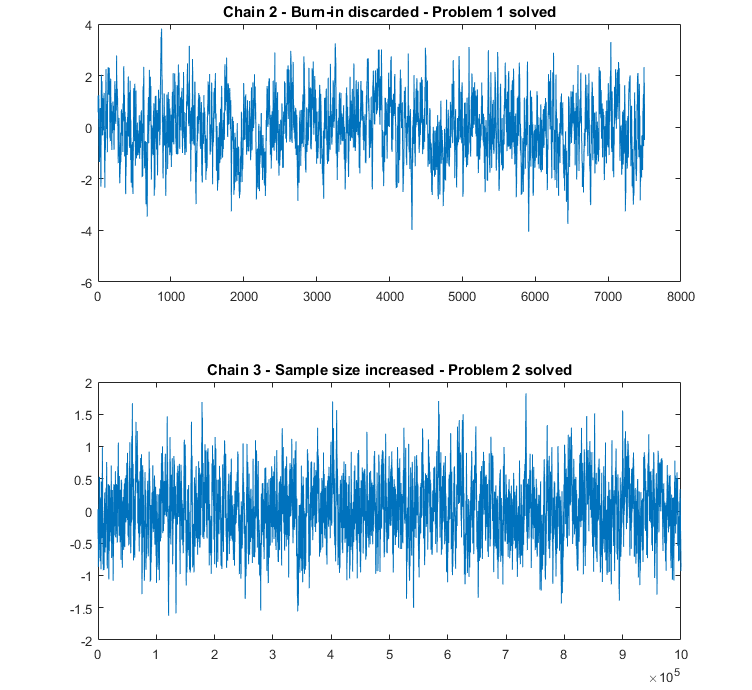

# Markow Chain diagnostics {#sec-chap-906}

```{r}
#| label: setup
#| results: hold
#| include: false

base::source(file = "R/helper.R")
ggplot2::theme_set(ggplot2::theme_bw())
```

:::::: {#obj-chap-906}
::::: my-objectives
::: my-objectives-header
Objectives
:::

::: my-objectives-container
This annex collects information about diagnostics tools for
`r glossary("Markov chain", "Markov chains")`.
:::
:::::
::::::

## Trace Plots {#sec-906-trace-plots}

See also @sec-006-examining-trace-plots.

**Trace plots** are a fundamental diagnostic tool in Markov Chain Monte
Carlo (`r glossary("MCMC")`) analysis used to visually assess the
convergence and mixing behavior of MCMC chains.

-   **Purpose**: A trace plot displays the sampled values of a model
    parameter against the iteration number of the MCMC algorithm.
-   **Interpretation**:
    -   A **well-converged chain** appears as a "fuzzy caterpillar" – it
        fluctuates rapidly around a stable mean with consistent
        variance, indicating good mixing and that the chain has reached
        the target posterior distribution.
    -   **Signs of non-convergence** include trends (upward or downward
        drift), flat sections (indicating the chain is stuck in a
        region), or clear multimodality (where the chain jumps between
        distinct modes), suggesting the chain has not adequately
        explored the parameter space.
-   **Key Use**: They are essential for diagnosing issues like
    insufficient burn-in periods, poor initial values, or model
    misspecification, and are almost universally required in scientific
    publications for MCMC studies.

### Good Mixing

-   A trace plot with **good mixing** resembles a "fuzzy caterpillar" or
    "hairy caterpillar."
-   The chain fluctuates rapidly around a stable mean, exploring the
    parameter space efficiently with low autocorrelation.
-   When multiple chains are run, their traces overlap and mix together
    seamlessly.
-   

### Poor Mixing

-   **"Skyline" or "Manhattan" Effect**: The plot shows long horizontal
    lines where the chain stays at the same value for many iterations,
    followed by sharp jumps. This indicates the chain is not moving
    frequently, resulting in high autocorrelation and poor exploration.
-   **Slow Drift**: The trace shows a slow, meandering trend or drift
    over time, rather than rapid fluctuations. This suggests the chain
    is moving too slowly through the parameter space.
-   **Getting Stuck**: The chain remains in a specific region (e.g.,
    near zero) for an extended period before making a jump. This is
    often seen in models with difficult geometry (e.g., hierarchical
    models with small variance parameters) and is a sign of poor
    exploration.

### Examples of good and poor mixing trace plots

::: {#nte-906-reference-trace-plots .callout-note}
The following notes in this section on trace plots is quoted from
Taboga, M. (n.d.). Markov Chain Monte Carlo (MCMC) diagnostics.
[StatLek](https://www.statlect.com/fundamentals-of-statistics/Markov-Chain-Monte-Carlo-diagnostics).
[@taboga]
:::

{#fig-906-trace-plots
fig-alt="Three trace plots vertically stacked: Top: Chain 1: Low serial correlation. No apparent problems. It shows a narrow and steadily zig-zag curve. Middle: Chain 2: Long burn-in - Problem 1. It show a curve that sinks slowly from the top of the window to the middle where it changes into a narrow and steadily zig-zag curve. Bottom: Chain 3: High serial correlation - Problem 2. It shows a curve like an stock index with narrow small zig-zags and very wide changes like long waves."
fig-align="center"}

In the **first trace plot (Chain 1)**, there are no apparent anomalies.
There seems to be a mild serial correlation between successive draws and
the chain seems to explore the sample space many times.

In the **second trace plot (Chain 2)**, the first part of the sample
(until around $t=1,500$) looks very different from the remaining part.
Most likely, the initial distribution and the distributions of the
subsequent terms of the chain were very different from the target
distribution, but then the chain slowly converged to the target
distribution (around $t=1,500$). We have **Problem 1: a large chunk of
the sample is drawn from distributions that are significantly different
from the target distribution.**

In the **third trace plot (Chain 3)**, there is a lot of serial
correlation between successive draws. The chain is very slow in
exploring the sample space. The sample space has been explored only few
times. In other words, there seems to be few independent observations in
our sample. Quite likely, we have **Problem 2: the effective size of our
sample is too small**.

### Solutions for bad mixings 

{#fig-906-trace-plots-solutions
fig-alt="Two trace plots vertically stacked. Both plots show a narrow and steadily zig-zag curve. Top: Chain 2 -- Burn-in discarded. Problem 1 solved. Bottom: Chain 3 -- Sample size increased. Problem 2 solved."
fig-align="center"}

In the first plot, the same sample from Chain 2 is used, but the burn-in
(the first $2,500$ observations) is discarded.

In the second plot, a new sample from Chain 3 is generated, but the
sample size is increased dramatically (from $10,000$ to $1,000,000$
draws) so as to increase the effective sample size and let the chain
explore the sample space many times.

In both cases, problems seem to have been solved: the trace plots of the
MCMC samples do not show any apparent anomaly.

We note that, although trace plots are pretty simple and informal
diagnostic tools, they seem to be the most frequently used: if you are
trying to publish an MCMC study in a scientific journal, it is very
likely that you will be asked to include your trace plots in the study!

## Parallel chains {#sec-906-parallel-chains}

See also @sec-006-comparing-parallel-chains

**Parallel chains** are a diagnostic tool used in Markov Chain Monte Carlo (MCMC) to assess convergence to the target posterior distribution. The core idea is to run multiple independent MCMC chains from different starting points and compare their behavior. If the chains have converged to the same stationary distribution, their sample distributions should be similar, indicating reliable inference.

The most widely used diagnostic based on parallel chains is the **Gelman-Rubin potential scale reduction factor ( $\hat{R}$ )**. This statistic compares the variance *within* each chain to the variance *between* chains. A value of $\hat{R}$ close to 1 (typically less than 1.05 or 1.1) suggests that the chains have mixed well and converged to the same distribution. If $\hat{R}$ is significantly greater than 1, it indicates that the chains have not yet converged, and longer simulations are needed.

**Key advantages and considerations:**
- **Robustness**: Using multiple chains is more robust than relying on a single chain's trace plot, which can be misleading.
- **Implementation**: The R {**coda**} package provides functions like `coda::gelman.diag()` to compute $\hat{R}$ and `coda::plot()` to visualize multiple chains.
- **Combining Results**: After discarding the burn-in period, samples from all chains can be pooled for final inference, as they are all samples from the posterior.
- **Limitation**: The method can be inefficient if the burn-in period is long, as each chain must go through its own burn-in phase, which can limit the theoretical speedup from parallelization.

## Effective sample size {#sec-906-effective-sample-size}

See also @sec-006-effective-sample-size.

**Effective Sample Size (ESS)** is a diagnostic tool in MCMC (Markov Chain Monte Carlo) analysis that estimates the number of **independent samples** equivalent to a given number of autocorrelated MCMC draws. Because MCMC samples are typically correlated, the ESS is usually **smaller than the total number of draws (N)**, reflecting reduced statistical efficiency.

- **Purpose**: ESS measures how much independent information is contained in autocorrelated MCMC chains. A higher ESS indicates better mixing and more reliable posterior estimates.
- **Interpretation**:
  - **Low ESS** (e.g., < 100–200) suggests poor mixing, high autocorrelation, and unreliable estimates.
  - **High ESS** (e.g., > 1,000) is generally sufficient for stable inference, especially for central tendency (bulk ESS) and tail probabilities (tail ESS).
- **Calculation**: ESS is computed using autocorrelation at different lags. The formula used in Stan and other tools is:
  $$
  N_{\text{eff}} = \frac{N}{1 + 2 \sum_{t=1}^{\infty} \rho_t}
  $$
  where $\rho_t$ is the autocorrelation at lag $t$.
- **Practical Use in R**:
  - Use `coda::effectiveSize()` or `bayestextR::effective_sample()` to compute ESS.
  - For multivariate models, consider `posterior::ess_bulk()` (for means/medians) and `posterior::ess-tails()` (for credible intervals).
- **Guidelines**:
  - **Tracer (BEAST)**: Flags ESS < 100 as problematic; aim for > 200.
  - **Stan/Bayesian models**: Aim for ESS > 1,000 for reliable inference.
  - **Adaptive stopping**: Use `mcmcse::minESS()` to determine required ESS based on desired precision.

In summary, **ESS is critical for assessing MCMC convergence and reliability**—a low ESS signals the need for longer chains, thinning, or better sampling strategies.

## Autocorrelation {#sec-906-autocorrelation}

See also @sec-006-autocorrelation

**Autocorrelation** in MCMC is a diagnostic tool that measures the correlation between samples in a Markov chain at different lags (i.e., how similar a sample is to one that occurs a certain number of steps earlier). It is used to assess **mixing efficiency** and **convergence** of the chain.

- **High autocorrelation** at small lags indicates that successive samples are highly dependent, meaning the chain is **mixing slowly** and may not be exploring the parameter space efficiently.
- **Rapid decay of autocorrelation** to zero as lag increases suggests the chain is **mixing well**, producing samples that are nearly independent—ideal for accurate posterior estimation.
- **Low autocorrelation** is desired because it implies better exploration of the posterior distribution and higher **effective sample size (ESS)**, leading to more precise Monte Carlo estimates.

In R, you can compute and visualize autocorrelation using functions like:
- `coda::autocorr()` to calculate autocorrelation at specified lags.
- `plotMCMC::plotAuto()` to create diagnostic plots.
- `bayesplot::mcmc_acf()` for visualizing autocorrelation across lags.

If autocorrelation remains high, **thinning** (keeping every *n*-th sample) may be considered, though running longer chains is often more efficient than thinning for improving ESS.

## R hat {#sec-906-r-hat}

See also @sec-006-calculating-r-hat.

**$\hat{R}$**, also known as the **potential scale reduction factor** or **Gelman-Rubin diagnostic**, is a widely used convergence diagnostic for Markov Chain Monte Carlo (MCMC) methods. It assesses whether multiple parallel chains have converged to the same target distribution by comparing the **within-chain variance** (W) and the **between-chain variance** (B).

The diagnostic is calculated as:
$$
\hat{R} = \sqrt{\frac{\widehat{\text{var}}^+}{W}}
$$
where $\hat{\text{var}}^+$ is an estimator of the marginal posterior variance that combines within- and between-chain variances, and $W$ is the average within-chain variance. **Values of $\hat{R}$ close to 1** indicate good convergence, while values substantially above 1 suggest the chains have not yet converged.

### Key Points:
- **Requires multiple chains** ($m \geq 2$) with overdispersed initial values.
- Chains are typically **split in half** after a warm-up period to assess mixing and stationarity.
- **Standard rule of thumb**: $\hat{R} < 1.1$ is often considered acceptable, though stricter thresholds (e.g., < 1.05) are recommended for high precision.
- **Limitations**: Traditional $\hat{R}$ can fail to detect convergence issues in cases of **heavy-tailed distributions** or **varying variances across chains**.

### Modern Improvements:
- **Rank-normalized $\hat{R}$** (Vehtari et al., 2021): Addresses failures in heavy-tailed or heterogeneous variance settings by using rank-based normalization, folding, and localization.
- **Local $\hat{R}$**: Focuses on convergence in specific regions (e.g., tails or bulk) of the distribution, improving sensitivity.
- **$R^*$**: A machine learning-based diagnostic that uses classifiers to detect chain differences, providing uncertainty estimates and detecting lack of mixing across all parameters.

These advanced versions aim to provide more robust and reliable convergence assessment than the original $\hat{R}$.


## Glossary Entries {.unnumbered}

```{r}
#| label: glossary-table
#| echo: false

glossary_table()
```

------------------------------------------------------------------------

## Session Info {.unnumbered}

::::: my-r-code
::: my-r-code-header
Session Info
:::

::: my-r-code-container
```{r}
#| label: session-info

sessioninfo::session_info()
```
:::
:::::
